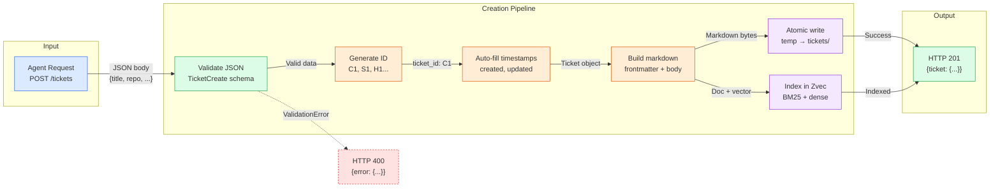
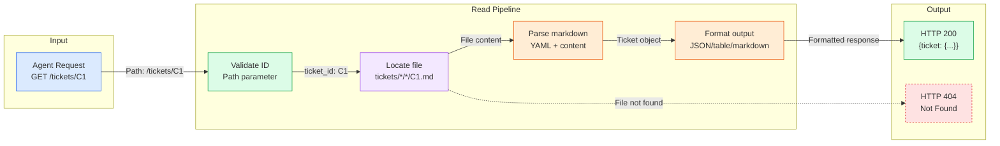
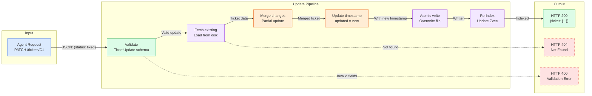
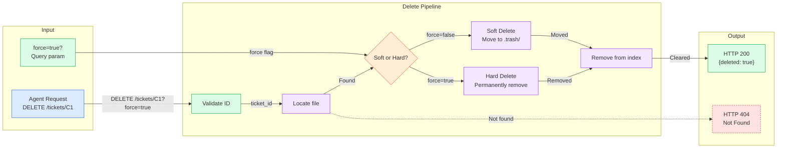
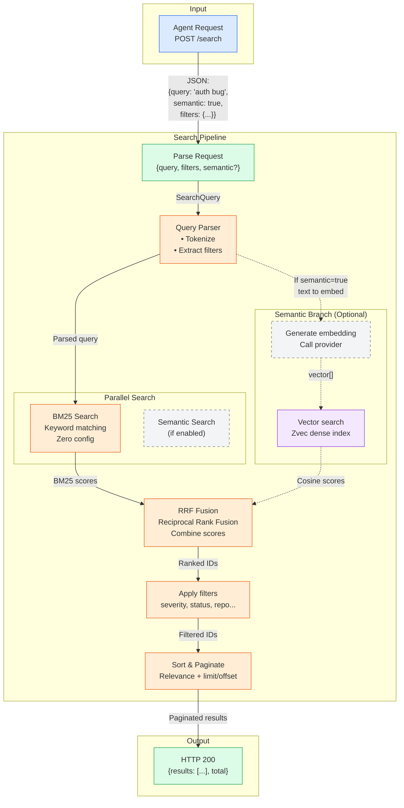
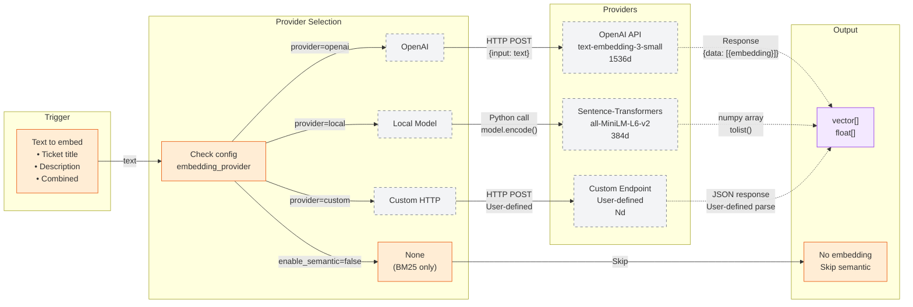
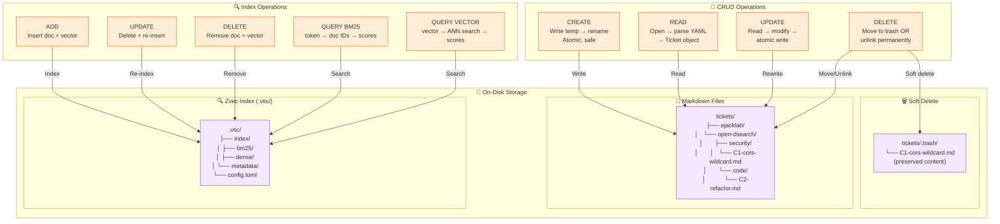

# vtic Data Flow Diagrams

> System overview and detailed data flows for the vtic ticket management system.

---

## Level 1: System Overview

A comprehensive view of the entire vtic architecture showing all components, data flows, and interactions.

```mermaid
flowchart TB
    %% ============================================
    %% LEGEND
    %% ============================================
    subgraph Legend["📋 Legend"]
        direction LR
        L1[Agent / User]:::agent
        L2[API Layer]:::api
        L3[Service]:::service
        L4[Storage]:::storage
        L5[Optional]:::optional
        
        L6["——→ Success Flow"]:::success
        L7["- - -→ Error Path"]:::error
        L8["-.-→ Optional Path"]:::optionalPath
        
        style Legend fill:#f8f9fa,stroke:#666,stroke-width:2px
    end

    %% ============================================
    %% AGENTS (Blue)
    %% ============================================
    subgraph Agents["👥 AI Agents (HTTP/JSON Clients)"]
        direction TB
        CCLow["🐈‍⬛ cclow<br/>Architecture & Ops"]:::agent
        Dave["👨‍💻 dave<br/>Backend Engineer"]:::agent
        Finan["📊 finan<br/>Finance & Analytics"]:::agent
        Ejack["🎯 Ejack<br/>Project Lead"]:::agent
    end

    %% ============================================
    %% API LAYER (Green)
    %% ============================================
    subgraph APILayer["🌐 FastAPI Server"]
        direction TB
        Router["Request Router<br/>• Path matching<br/>• Auth check"]:::api
        
        subgraph Endpoints["REST Endpoints"]
            POST_T["POST /tickets<br/>Create"]:::api
            GET_T["GET /tickets/:id<br/>Read"]:::api
            PATCH_T["PATCH /tickets/:id<br/>Update"]:::api
            DEL_T["DELETE /tickets/:id<br/>Delete"]:::api
            LIST_T["GET /tickets<br/>List"]:::api
            POST_S["POST /search<br/>Search"]:::api
            HEALTH["GET /health<br/>Health"]:::api
        end
        
        Validation["Pydantic Validation<br/>• Schema check<br/>• Type coercion"]:::api
        ErrorHandler["Error Handler<br/>• Exception catch<br/>• JSON error response"]:::api
    end

    %% ============================================
    %% SERVICES (Orange)
    %% ============================================
    subgraph Services["⚙️ Business Logic Services"]
        direction TB
        
        subgraph TicketSvc["Ticket Service (CRUD)"]
            CreateLogic["Create Logic<br/>• ID generation<br/>• Timestamp fill<br/>• Validation"]:::service
            ReadLogic["Read Logic<br/>• Fetch by ID<br/>• Format output"]:::service
            UpdateLogic["Update Logic<br/>• Partial update<br/>• Timestamp update"]:::service
            DeleteLogic["Delete Logic<br/>• Soft/hard delete<br/>• Trash management"]:::service
            ListLogic["List Logic<br/>• Filtering<br/>• Sorting<br/>• Pagination"]:::service
        end
        
        subgraph SearchSvc["Search Engine (Hybrid)"]
            QueryParser["Query Parser<br/>• Tokenize<br/>• Extract filters"]:::service
            BM25["BM25 Engine<br/>• Keyword search<br/>• Exact match<br/>• Built-in, zero config"]:::service
            HybridFusion["RRF Fusion<br/>• Combine scores<br/>• Rank results"]:::service
        end
    end

    %% ============================================
    %% EMBEDDING (Gray - Optional)
    %% ============================================
    subgraph Embedding["🔌 Embedding Provider (Optional)"]
        direction TB
        EmbedRouter["Provider Router"]:::optional
        OpenAI["OpenAI API<br/>text-embedding-3-small<br/>1536 dimensions"]:::optional
        LocalModel["Local Model<br/>sentence-transformers<br/>all-MiniLM-L6-v2"]:::optional
        CustomProvider["Custom HTTP<br/>Provider"]:::optional
    end

    %% ============================================
    %% STORAGE (Purple)
    %% ============================================
    subgraph Storage["💾 Storage Layer"]
        direction TB
        
        subgraph MarkdownStorage["📄 Markdown Files"]
            DirStructure["Directory Structure<br/>tickets/{owner}/{repo}/{category}/"]:::storage
            TicketFiles["Ticket Files<br/>{id}-{slug}.md"]:::storage
            TrashDir[".trash/<br/>(soft deleted)"]:::storage
        end
        
        subgraph ZvecIndex["🔍 Zvec Index"]
            BM25Index["BM25 Index<br/>(inverted index)"]:::storage
            DenseIndex["Dense Vector Index<br/>(optional)"]:::storage
            MetaIndex["Metadata Index<br/>(filters, sorting)"]:::storage
        end
    end

    %% ============================================
    %% DATA FLOWS
    %% ============================================
    
    %% Agents → API
    CCLow -->|"HTTP/JSON<br/>POST/GET/PATCH/DELETE"| Router
    Dave -->|"HTTP/JSON<br/>POST/GET/PATCH/DELETE"| Router
    Finan -->|"HTTP/JSON<br/>POST/GET/PATCH/DELETE"| Router
    Ejack -->|"HTTP/JSON<br/>POST/GET/PATCH/DELETE"| Router
    
    %% Router → Endpoints
    Router -->|"Route by path"| POST_T
    Router -->|"Route by path"| GET_T
    Router -->|"Route by path"| PATCH_T
    Router -->|"Route by path"| DEL_T
    Router -->|"Route by path"| LIST_T
    Router -->|"Route by path"| POST_S
    Router -->|"Route by path"| HEALTH
    
    %% Endpoints → Validation
    POST_T -->|"JSON payload"| Validation
    GET_T -->|"Path param"| Validation
    PATCH_T -->|"JSON payload"| Validation
    DEL_T -->|"Path param"| Validation
    LIST_T -->|"Query params"| Validation
    POST_S -->|"JSON payload"| Validation
    
    %% Validation → Error (dotted)
    Validation -.->|"ValidationError<br/>JSON error response"| ErrorHandler
    ErrorHandler -.->|"HTTP 400/422<br/>{error: {...}}"| Router
    
    %% Validation → Services
    Validation -->|"Valid request<br/>TicketCreate/Update/Search"| CreateLogic
    Validation -->|"Valid request<br/>ticket_id"| ReadLogic
    Validation -->|"Valid request<br/>TicketUpdate"| UpdateLogic
    Validation -->|"Valid request<br/>ticket_id, force"| DeleteLogic
    Validation -->|"Valid request<br/>FilterParams"| ListLogic
    Validation -->|"Valid request<br/>SearchQuery"| QueryParser
    
    %% Ticket Service → Storage
    CreateLogic -->|"Markdown content<br/>+ metadata"| DirStructure
    ReadLogic -->|"ticket_id"| TicketFiles
    UpdateLogic -->|"Updated markdown<br/>+ metadata"| TicketFiles
    DeleteLogic -->|"Move or delete"| TicketFiles
    DeleteLogic -->|"Soft delete target"| TrashDir
    ListLogic -->|"Filter criteria"| MetaIndex
    
    %% Create → ID Generator
    CreateLogic -->|"category, repo"| IDGen["ID Generator<br/>C1, S1, H1..."]:::service
    IDGen -->|"ticket_id"| CreateLogic
    
    %% Search Flow
    QueryParser -->|"Parsed query<br/>+ filters"| BM25
    QueryParser -.->|"If semantic enabled<br/>text to embed"| EmbedRouter
    
    EmbedRouter -.->|"HTTP/JSON<br/>API call"| OpenAI
    EmbedRouter -.->|"Local inference<br/>Python call"| LocalModel
    EmbedRouter -.->|"HTTP/JSON<br/>Custom endpoint"| CustomProvider
    
    OpenAI -.->|"vector[]<br/>1536 floats"| DenseIndex
    LocalModel -.->|"vector[]<br/>384 floats"| DenseIndex
    CustomProvider -.->|"vector[]<br/>n floats"| DenseIndex
    
    DenseIndex -.->|"semantic scores"| HybridFusion
    BM25 -->|"keyword scores"| HybridFusion
    HybridFusion -->|"merged results<br/>SearchResponse"| Router
    
    %% Storage → Service (returns)
    TicketFiles -->|"Ticket markdown<br/>parsed to object"| ReadLogic
    TicketFiles -->|"File content<br/>or None"| UpdateLogic
    DirStructure -->|"path created"| CreateLogic
    MetaIndex -->|"filtered IDs"| ListLogic
    
    %% Index Updates
    CreateLogic -->|"Index add<br/>doc + embedding"| BM25Index
    UpdateLogic -->|"Index update<br/>doc + embedding"| BM25Index
    DeleteLogic -->|"Index remove<br/>doc_id"| BM25Index
    
    CreateLogic -.->|"If semantic enabled<br/>vector + metadata"| DenseIndex
    UpdateLogic -.->|"If semantic enabled<br/>update vector"| DenseIndex
    DeleteLogic -.->|"Remove vector"| DenseIndex
    
    %% Error paths from services
    ReadLogic -.->|"TicketNotFound<br/>HTTP 404"| ErrorHandler
    UpdateLogic -.->|"TicketNotFound<br/>HTTP 404"| ErrorHandler
    DeleteLogic -.->|"TicketNotFound<br/>HTTP 404"| ErrorHandler
    
    %% Response flow
    CreateLogic -->|"Ticket JSON<br/>HTTP 201"| Router
    ReadLogic -->|"Ticket JSON<br/>HTTP 200"| Router
    HEALTH -->|"HTTP 200<br/>{status: ok}"| Router
    UpdateLogic -->|"Ticket JSON<br/>HTTP 200"| Router
    DeleteLogic -->|"Success JSON<br/>HTTP 200"| Router
    ListLogic -->|"Ticket[] JSON<br/>HTTP 200"| Router
    
    %% Legend to visual flow
    style Legend fill:#f8f9fa,stroke:#666,stroke-width:2px
    
    %% Class definitions
    classDef agent fill:#dbeafe,stroke:#2563eb,stroke-width:2px,color:#1e40af
    classDef api fill:#dcfce7,stroke:#16a34a,stroke-width:2px,color:#166534
    classDef service fill:#ffedd5,stroke:#ea580c,stroke-width:2px,color:#9a3412
    classDef storage fill:#f3e8ff,stroke:#9333ea,stroke-width:2px,color:#6b21a8
    classDef optional fill:#f3f4f6,stroke:#6b7280,stroke-width:2px,color:#374151,stroke-dasharray: 5 5
    classDef success stroke:#16a34a,stroke-width:2px
    classDef error stroke:#dc2626,stroke-width:2px,stroke-dasharray: 3 3
    classDef optionalPath stroke:#6b7280,stroke-width:2px,stroke-dasharray: 5 5
```



### Color/Line Convention Guide

| Element | Color | Usage |
|---------|-------|-------|
| **Agents/Users** | 🔵 Blue | External clients making HTTP requests |
| **API Layer** | 🟢 Green | FastAPI server, endpoints, routing |
| **Services** | 🟠 Orange | Business logic, CRUD, search algorithms |
| **Storage** | 🟣 Purple | Markdown files, Zvec index on disk |
| **Optional** | ⚪ Gray | Embedding providers, semantic search |
| **Success Flow** | —— Solid | Normal operation path |
| **Error Path** | - - Dotted | Error/exception handling |
| **Optional Path** | -.- Dash-dot | Only used when feature enabled |

### Data Formats by Connection

| Connection | Format | Description |
|------------|--------|-------------|
| Agents → API | HTTP/JSON | REST API calls with JSON payloads |
| Router → Validation | Python object | FastAPI request objects |
| Validation → Services | Pydantic models | Validated `TicketCreate`, `SearchQuery`, etc. |
| Services → Markdown | File I/O | Atomic write to `.md` temp → rename |
| Services → Zvec | Python API | Zvec in-process function calls |
| Embedding → Provider | HTTP/JSON or Python | OpenAI API or local model inference |
| Embedding → Zvec | `vector[]` | Float arrays (384-1536 dimensions) |

---

## Level 2: Detailed Component Flows

### 2.1 Ticket Creation Flow



**Data Transformations:**
1. `JSON → Pydantic` - Request body validated against `TicketCreate` schema
2. `Schema → Ticket` - Validated data becomes `Ticket` dataclass
3. `Ticket → Markdown` - Rendered to `.md` file with YAML frontmatter
4. `Ticket → Vector` - (Optional) Text embedded to float array for semantic search

---

### 2.2 Ticket Read Flow



**Data Transformations:**
1. `Path → ID` - Extract `C1` from URL path
2. `ID → File Path` - Resolve to `tickets/{owner}/{repo}/{category}/C1-*.md`
3. `Markdown → Object` - Parse YAML frontmatter + markdown body → `Ticket` dataclass
4. `Object → Response` - Serialize to requested format (JSON default)

---

### 2.3 Ticket Update Flow



**Data Transformations:**
1. `JSON Patch → Update Object` - Partial fields validated
2. `Existing + Update → Merged` - Only specified fields changed
3. `Merged → Markdown` - Re-rendered to file
4. `Re-index` - Update BM25 and (optionally) dense vectors

---

### 2.4 Ticket Delete Flow



**Data Transformations:**
- Soft: `tickets/.../C1.md` → `.trash/C1.md`
- Hard: File permanently deleted from filesystem
- Index: Document and vectors removed from Zvec

---

### 2.5 Search Flow (Hybrid BM25 + Semantic)



**Data Transformations:**
1. `Query Text → Tokens` - BM25 tokenization
2. `Query Text → Vector` - (Optional) Embedding provider → float array
3. `Tokens → Doc IDs` - BM25 inverted index lookup
4. `Vector → Doc IDs` - Dense vector similarity search
5. `Ranked Lists → Merged` - RRF (Reciprocal Rank Fusion) algorithm
6. `IDs → Tickets` - Fetch full documents from markdown files

---

### 2.6 Embedding Provider Flow



**Data Transformations:**
- Input: Plain text string (title, description, or combined)
- OpenAI: Text → HTTP POST → JSON response → Extract `embedding` array
- Local: Text → `model.encode(text)` → numpy array → Python list
- Output: `List[float]` with 384-1536 dimensions (provider-dependent)

---

### 2.7 Storage Layer Detail



**Storage Guarantees:**
- **Atomic Writes**: Write to temp file, then atomic rename
- **Git Compatible**: Markdown is human-readable, diff-friendly
- **Index Rebuildable**: Zvec index can be regenerated from markdown files
- **Soft Delete**: Default safe deletion to `.trash/` directory

---

## Data Format Reference

### Ticket JSON (API)

```json
{
  "id": "C1",
  "title": "CORS Wildcard in Production",
  "repo": "ejacklab/open-dsearch",
  "category": "security",
  "severity": "critical",
  "status": "open",
  "description": "All FastAPI services use allow_origins=['*']...",
  "fix": "Use ALLOWED_ORIGINS from env...",
  "tags": ["cors", "security", "fastapi"],
  "file_refs": ["backend/api-gateway/main.py:27-32"],
  "created": "2026-03-17T10:00:00Z",
  "updated": "2026-03-17T10:00:00Z"
}
```

### Ticket Markdown (Storage)

```markdown
# C1 - CORS Wildcard in Production

**Severity:** critical
**Status:** open
**Category:** security
**Repo:** ejacklab/open-dsearch
**File:** backend/api-gateway/main.py:27-32
**Created:** 2026-03-17
**Updated:** 2026-03-17

## Description
All FastAPI services use allow_origins=['*'] which enables CSRF attacks.

## Fix
Use ALLOWED_ORIGINS from environment variable.
```

### Search Request/Response

**Request:**
```json
{
  "query": "auth security issues",
  "semantic": true,
  "filters": {
    "severity": "critical",
    "status": "open",
    "repo": "ejacklab/*"
  },
  "limit": 10
}
```

**Response:**
```json
{
  "data": {
    "results": [
      {
        "ticket": { /* full ticket */ },
        "score": 0.89,
        "bm25_score": 0.75,
        "semantic_score": 0.93
      }
    ],
    "total": 42
  },
  "meta": {
    "query": "auth security issues",
    "duration_ms": 45
  }
}
```

---

## Error Handling Patterns

### HTTP Status Codes

| Code | When | Response Body |
|------|------|---------------|
| 200 | Success | `{data: {...}}` |
| 201 | Created | `{data: {ticket: {...}}}` |
| 400 | Bad Request (validation) | `{error: {code, message, details}}` |
| 404 | Not Found | `{error: {code: "TICKET_NOT_FOUND"}}` |
| 422 | Unprocessable Entity | `{error: {code, message, field_errors}}` |
| 500 | Internal Server Error | `{error: {code: "INTERNAL_ERROR"}}` |

### Error Response Format

```json
{
  "error": {
    "code": "VALIDATION_ERROR",
    "message": "Request validation failed",
    "details": {
      "field_errors": [
        {"field": "title", "message": "Title is required", "code": "REQUIRED"}
      ]
    }
  }
}
```

---

## Architecture Principles

1. **Local-First**: Markdown files are source of truth; Zvec is derived/cached
2. **Zero Config**: BM25 works out of the box; embeddings are optional
3. **Git Native**: File format optimized for version control
4. **Atomic Operations**: Writes are atomic (temp + rename)
5. **In-Process**: No external database server; Zvec runs in Python process
6. **Pluggable**: Bring your own embedding provider
7. **RESTful**: Standard HTTP methods with consistent JSON envelopes

---

*Generated for vtic - Lightweight local-first ticket system with vector search*
