# vtic — Detailed Data Flows (3-Level Walkthrough)

**Version:** 1.0  
**Date:** March 18, 2026  
**Canonical Reference:** OpenAPI 3.1.1 Specification

---

## Table of Contents

1. [Overview](#1-overview)
2. [Data Flow Patterns](#2-data-flow-patterns)
3. [Stage 1: Foundation Operations](#3-stage-1-foundation-operations)
4. [Stage 2: CRUD Operations](#4-stage-2-crud-operations)
5. [Stage 2: Search Operations](#5-stage-2-search-operations)
6. [Stage 3: Bulk Operations](#6-stage-3-bulk-operations)
7. [Import/Export Flows](#7-importexport-flows)
8. [Management Flows](#8-management-flows)
9. [Error Handling](#9-error-handling)

---

## 1. Overview

### 1.1 Document Purpose

This document provides detailed, step-by-step walkthroughs for every vtic operation. Each flow is documented at three levels:

- **Level 1:** High-level request/response flow
- **Level 2:** Internal component interactions
- **Level 3:** Data structure transformations

### 1.2 Key Terminology

| Term | Description |
|------|-------------|
| `ticket_id` | Human-readable ID with category prefix (e.g., C1, H5, F12, S3, G8) |
| `SearchQuery` | Search request object with query string, filters, and pagination |
| `SearchHit` | Single search result containing `ticket_id`, `score`, `source` |
| `FilterSet` | Collection of filters using arrays for multi-select |
| `source` | Search match type: `bm25`, `semantic`, or `hybrid` |

### 1.3 Category ID Prefixes

| Category | Prefix | Pattern |
|----------|--------|---------|
| crash | C | `C\d+` |
| hotfix | H | `H\d+` |
| feature | F | `F\d+` |
| security | S | `S\d+` |
| general | G | `G\d+` |

**ID Pattern:** `^[CFGHST]\d+$`

---

## 2. Data Flow Patterns

### 2.1 Request Flow Pattern

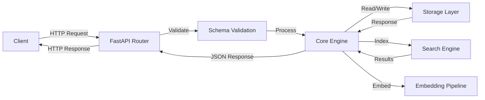
```mermaid
flowchart LR
    Client -->|HTTP Request| API[FastAPI Router]
    API -->|Validate| Schema[Schema Validation]
    Schema -->|Process| Core[Core Engine]
    Core -->|Read/Write| Storage[Storage Layer]
    Core -->|Index| Search[Search Engine]
    Core -->|Embed| Embed[Embedding Pipeline]
    Storage -->|Response| Core
    Search -->|Results| Core
    Core -->|JSON Response| API
    API -->|HTTP Response| Client
```

### 2.2 Response Envelope Patterns

**Success Response:**
```json
{
  "data": { ... },
  "meta": {
    "request_id": "req_abc123"
  }
}
```

**Error Response:**
```json
{
  "error": {
    "code": "VALIDATION_ERROR",
    "message": "Human-readable error description",
    "details": [
      { "field": "title", "message": "Title is required" }
    ]
  }
}
```

---

## 3. Stage 1: Foundation Operations

### 3.1 Health Check Flow

**Endpoint:** `GET /health`  
**Auth:** None (public endpoint)

#### Level 1: Request/Response

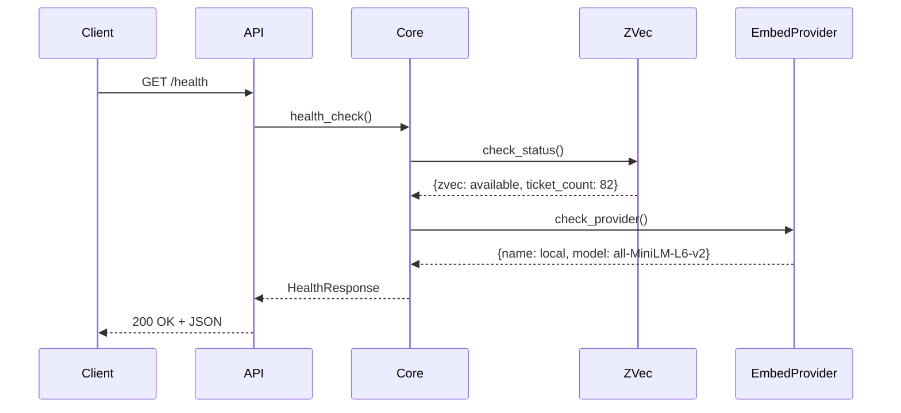
```mermaid
sequenceDiagram
    participant Client
    participant API
    participant Core
    participant ZVec
    participant EmbedProvider

    Client->>API: GET /health
    API->>Core: health_check()
    Core->>ZVec: check_status()
    ZVec-->>Core: {zvec: available, ticket_count: 82}
    Core->>EmbedProvider: check_provider()
    EmbedProvider-->>Core: {name: local, model: all-MiniLM-L6-v2}
    Core-->>API: HealthResponse
    API-->>Client: 200 OK + JSON
```

#### Level 2: Component Interactions

1. **API Layer** (`api/routes/system.py`):
   - No authentication required
   - No request body parsing needed
   - Calls `core.health_check()`

2. **Core Layer** (`core/health.py`):
   - Checks ZVec index availability
   - Verifies embedding provider status
   - Calculates uptime

3. **Storage Layer** (`storage/index.py`):
   - Queries ZVec for ticket count
   - Checks last reindex timestamp

#### Level 3: Data Structures

**Response Schema:**
```yaml
HealthResponse:
  status: healthy | degraded | unhealthy
  version: string
  uptime_seconds: integer | null
  index_status:
    IndexStatus:
      zvec: available | unavailable | corrupted
      ticket_count: integer
      last_reindex: datetime | null
  embedding_provider:
    EmbeddingProviderInfo:
      name: local | openai | custom | none
      model: string | null
      dimension: integer | null
```

**Example Response:**
```json
{
  "status": "healthy",
  "version": "0.1.0",
  "uptime_seconds": 86400,
  "index_status": {
    "zvec": "available",
    "ticket_count": 82,
    "last_reindex": "2026-03-17T08:00:00Z"
  },
  "embedding_provider": {
    "name": "local",
    "model": "all-MiniLM-L6-v2",
    "dimension": 384
  }
}
```

---

### 3.2 Configuration Flow

**Endpoint:** `GET /config`  
**Auth:** Required

#### Level 1: Request/Response

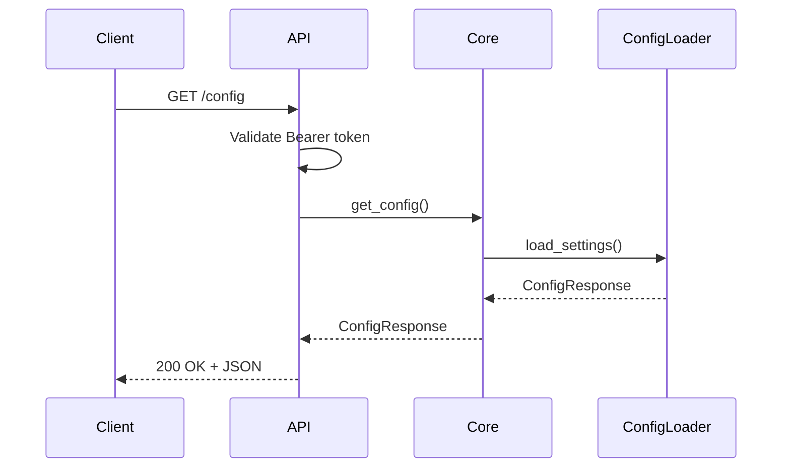
```mermaid
sequenceDiagram
    participant Client
    participant API
    participant Core
    participant ConfigLoader

    Client->>API: GET /config
    API->>API: Validate Bearer token
    API->>Core: get_config()
    Core->>ConfigLoader: load_settings()
    ConfigLoader-->>Core: ConfigResponse
    Core-->>API: ConfigResponse
    API-->>Client: 200 OK + JSON
```

#### Level 2: Component Interactions

1. **API Layer** (`api/routes/system.py`):
   - Validates authentication
   - Checks permissions
   - Returns current configuration

2. **Core Layer** (`core/config.py`):
   - Loads from vtic.toml
   - Applies environment variable overrides
   - Merges with defaults

#### Level 3: Data Structures

**Response Schema:**
```yaml
ConfigResponse:
  storage:
    dir: string
  search:
    bm25_enabled: boolean
    semantic_enabled: boolean
    bm25_weight: number
    semantic_weight: number
  embeddings:
    provider: local | openai | custom | none
    model: string | null
    dimension: integer | null
  api:
    host: string
    port: integer
```

**Example Response:**
```json
{
  "storage": {
    "dir": "./tickets"
  },
  "search": {
    "bm25_enabled": true,
    "semantic_enabled": true,
    "bm25_weight": 0.6,
    "semantic_weight": 0.4
  },
  "embeddings": {
    "provider": "local",
    "model": "all-MiniLM-L6-v2",
    "dimension": 384
  },
  "api": {
    "host": "0.0.0.0",
    "port": 8080
  }
}
```

---

### 3.3 Update Configuration Flow

**Endpoint:** `PATCH /config`  
**Auth:** Required (admin)

#### Level 1: Request/Response

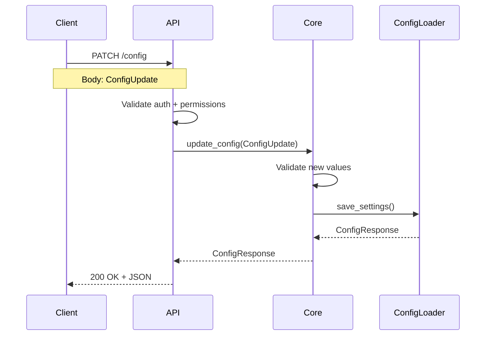
```mermaid
sequenceDiagram
    participant Client
    participant API
    participant Core
    participant ConfigLoader

    Client->>API: PATCH /config
    Note over Client,API: Body: ConfigUpdate
    API->>API: Validate auth + permissions
    API->>Core: update_config(ConfigUpdate)
    Core->>Core: Validate new values
    Core->>ConfigLoader: save_settings()
    ConfigLoader-->>Core: ConfigResponse
    Core-->>API: ConfigResponse
    API-->>Client: 200 OK + JSON
```

#### Level 3: Data Structures

**Request Schema:**
```yaml
ConfigUpdate:
  storage:
    dir: string (optional)
  search:
    bm25_enabled: boolean (optional)
    semantic_enabled: boolean (optional)
    bm25_weight: number 0-1 (optional)
    semantic_weight: number 0-1 (optional)
  embeddings:
    provider: EmbeddingProvider (optional)
    model: string | null (optional)
    dimension: integer | null (optional)
  api:
    host: string (optional)
    port: integer 1-65535 (optional)
```

**Example Request:**
```json
{
  "api": {
    "port": 9000
  },
  "search": {
    "semantic_weight": 0.5
  }
}
```

---

### 3.4 Diagnostic Flow

**Endpoint:** `GET /doctor`  
**Auth:** Required

#### Level 1: Request/Response

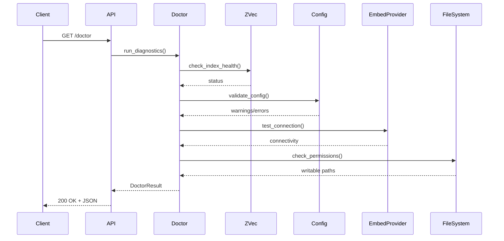
```mermaid
sequenceDiagram
    participant Client
    participant API
    participant Doctor
    participant ZVec
    participant Config
    participant EmbedProvider
    participant FileSystem

    Client->>API: GET /doctor
    API->>Doctor: run_diagnostics()
    
    Doctor->>ZVec: check_index_health()
    ZVec-->>Doctor: status
    
    Doctor->>Config: validate_config()
    Config-->>Doctor: warnings/errors
    
    Doctor->>EmbedProvider: test_connection()
    EmbedProvider-->>Doctor: connectivity
    
    Doctor->>FileSystem: check_permissions()
    FileSystem-->>Doctor: writable paths
    
    Doctor-->>API: DoctorResult
    API-->>Client: 200 OK + JSON
```

#### Level 3: Data Structures

**Response Schema:**
```yaml
DoctorResult:
  overall: ok | warnings | errors
  checks:
    - name: string
      status: ok | warning | error
      message: string | null
      fix: string | null
```

**Example Response:**
```json
{
  "overall": "warnings",
  "checks": [
    {
      "name": "zvec_index",
      "status": "ok",
      "message": "Index is healthy with 82 tickets",
      "fix": null
    },
    {
      "name": "config_file",
      "status": "warning",
      "message": "Using deprecated config key",
      "fix": "Update to 'embeddings.provider' in vtic.toml"
    }
  ]
}
```

---

## 4. Stage 2: CRUD Operations

### 4.1 Create Ticket Flow

**Endpoint:** `POST /tickets`  
**Auth:** Required

#### Level 1: Request/Response

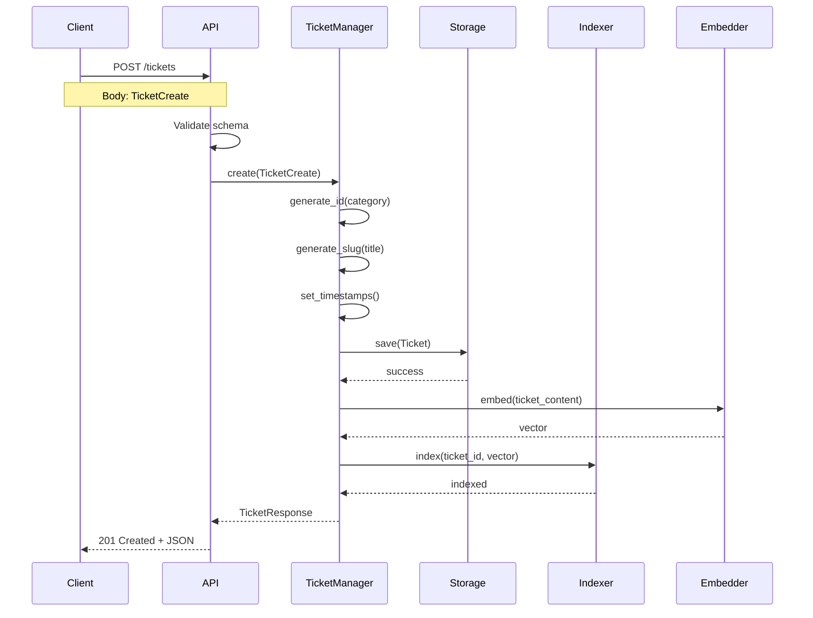
```mermaid
sequenceDiagram
    participant Client
    participant API
    participant TicketManager
    participant Storage
    participant Indexer
    participant Embedder

    Client->>API: POST /tickets
    Note over Client,API: Body: TicketCreate
    API->>API: Validate schema
    API->>TicketManager: create(TicketCreate)
    
    TicketManager->>TicketManager: generate_id(category)
    TicketManager->>TicketManager: generate_slug(title)
    TicketManager->>TicketManager: set_timestamps()
    
    TicketManager->>Storage: save(Ticket)
    Storage-->>TicketManager: success
    
    TicketManager->>Embedder: embed(ticket_content)
    Embedder-->>TicketManager: vector
    
    TicketManager->>Indexer: index(ticket_id, vector)
    Indexer-->>TicketManager: indexed
    
    TicketManager-->>API: TicketResponse
    API-->>Client: 201 Created + JSON
```

#### Level 2: Component Interactions

1. **API Layer** (`api/routes/tickets.py`):
   - Validates `TicketCreate` schema
   - Ensures required fields present
   - Calls `ticket_manager.create()`

2. **Core Layer** (`core/ticket.py`):
   - Generates ID based on category:
     - `crash` → C1, C2, ...
     - `hotfix` → H1, H2, ...
     - `feature` → F1, F2, ...
     - `security` → S1, S2, ...
     - `general` → G1, G2, ...
   - Generates URL slug from title
   - Sets `created` and `updated` timestamps
   - Triggers embedding generation
   - Updates ZVec index

3. **Storage Layer** (`storage/markdown.py`):
   - Creates directory structure: `tickets/{owner}/{repo}/{category}/`
   - Writes markdown file with YAML frontmatter

#### Level 3: Data Structures

**Request Schema:**
```yaml
TicketCreate:
  title: string (required, 1-200 chars)
  description: string (required)
  repo: string (required, owner/repo format)
  category: Category (default: general)
  severity: Severity (default: medium)
  status: Status (default: open)
  assignee: string | null
  tags: string[] (max 20, each max 50 chars)
  references: string[] (ticket IDs matching ^[CFGHST]\d+$)
```

**Response Schema:**
```yaml
TicketResponse:
  data: Ticket
  meta:
    request_id: string
    warnings: string[]
```

**Ticket Schema:**
```yaml
Ticket:
  id: string (pattern: ^[CFGHST]\d+$)
  slug: string
  title: string
  description: string
  repo: string
  category: Category
  severity: Severity
  status: Status
  assignee: string | null
  fix: string | null
  tags: string[]
  references: string[]
  created: datetime (ISO 8601)
  updated: datetime (ISO 8601)
```

**Example Request:**
```json
{
  "title": "CORS Wildcard Issue",
  "description": "The API allows wildcard CORS origins in production environments.",
  "repo": "ejacklab/open-dsearch",
  "category": "security",
  "severity": "high",
  "tags": ["cors", "security", "api"]
}
```

**Example Response (201):**
```json
{
  "data": {
    "id": "S1",
    "slug": "cors-wildcard-issue",
    "title": "CORS Wildcard Issue",
    "description": "The API allows wildcard CORS origins in production environments.",
    "repo": "ejacklab/open-dsearch",
    "category": "security",
    "severity": "high",
    "status": "open",
    "assignee": null,
    "fix": null,
    "tags": ["cors", "security", "api"],
    "references": [],
    "created": "2026-03-17T09:00:00Z",
    "updated": "2026-03-17T09:00:00Z"
  },
  "meta": {
    "request_id": "req_abc123",
    "warnings": []
  }
}
```

---

### 4.2 Get Ticket Flow

**Endpoint:** `GET /tickets/{ticket_id}`  
**Auth:** Required

#### Level 1: Request/Response

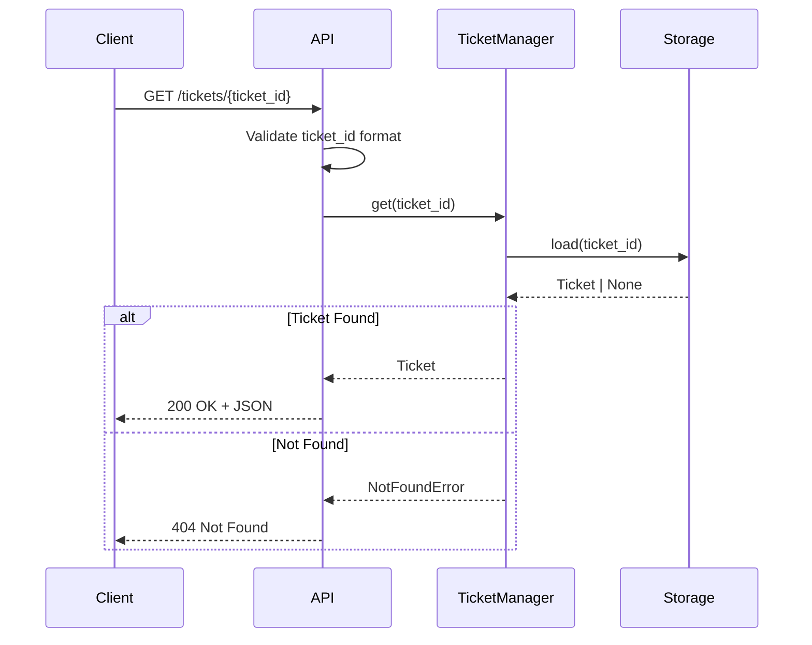
```mermaid
sequenceDiagram
    participant Client
    participant API
    participant TicketManager
    participant Storage

    Client->>API: GET /tickets/{ticket_id}
    API->>API: Validate ticket_id format
    API->>TicketManager: get(ticket_id)
    TicketManager->>Storage: load(ticket_id)
    Storage-->>TicketManager: Ticket | None
    
    alt Ticket Found
        TicketManager-->>API: Ticket
        API-->>Client: 200 OK + JSON
    else Not Found
        TicketManager-->>API: NotFoundError
        API-->>Client: 404 Not Found
    end
```

#### Level 2: Component Interactions

1. **API Layer**:
   - Validates `ticket_id` matches pattern `^[CFGHST]\d+$`
   - Supports `format` query parameter (json, markdown, yaml, csv)

2. **Core Layer**:
   - Looks up ticket by ID
   - Returns full ticket object

3. **Storage Layer**:
   - Reads markdown file from disk
   - Parses YAML frontmatter

#### Level 3: Data Structures

**Path Parameter:**
```yaml
ticket_id: string (pattern: ^[CFGHST]\d+$)
```

**Query Parameters:**
```yaml
format: json | markdown | yaml | csv (default: json)
```

---

### 4.3 List Tickets Flow

**Endpoint:** `GET /tickets`  
**Auth:** Required

#### Level 1: Request/Response

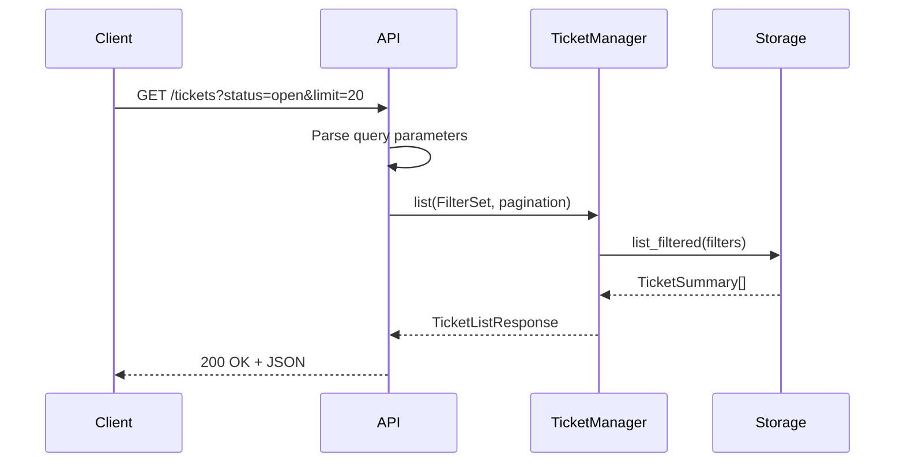
```mermaid
sequenceDiagram
    participant Client
    participant API
    participant TicketManager
    participant Storage

    Client->>API: GET /tickets?status=open&limit=20
    API->>API: Parse query parameters
    API->>TicketManager: list(FilterSet, pagination)
    TicketManager->>Storage: list_filtered(filters)
    Storage-->>TicketManager: TicketSummary[]
    TicketManager-->>API: TicketListResponse
    API-->>Client: 200 OK + JSON
```

#### Level 2: Component Interactions

1. **API Layer**:
   - Parses filter query parameters
   - Builds `FilterSet` object
   - Applies pagination (limit/offset)

2. **Core Layer**:
   - Applies filters to storage query
   - Sorts results by specified field
   - Returns paginated results

#### Level 3: Data Structures

**Query Parameters:**
```yaml
severity: Severity[] (comma-separated)
status: Status[] (comma-separated)
category: Category[] (comma-separated)
repo: string[] (comma-separated, supports glob)
assignee: string
tags: string[] (comma-separated, AND logic)
created_after: datetime
created_before: datetime
sort: string (default: -created, prefix - for descending)
limit: integer (default: 20, max: 100)
offset: integer (default: 0)
format: json | markdown | yaml | csv
```

**Response Schema:**
```yaml
TicketListResponse:
  data: TicketSummary[]
  meta:
    total: integer
    limit: integer
    offset: integer
    has_more: boolean
    request_id: string
```

**TicketSummary Schema:**
```yaml
TicketSummary:
  id: string
  title: string
  severity: Severity
  status: Status
  repo: string
  category: Category
  assignee: string | null
  created: datetime
  updated: datetime
```

**Example Request:**
```
GET /tickets?status=open,in_progress&severity=high,critical&limit=10&sort=-created
```

**Example Response:**
```json
{
  "data": [
    {
      "id": "C1",
      "title": "CORS Wildcard Issue",
      "severity": "high",
      "status": "open",
      "repo": "ejacklab/open-dsearch",
      "category": "crash",
      "assignee": "ejack",
      "created": "2026-03-17T09:00:00Z",
      "updated": "2026-03-17T14:30:00Z"
    }
  ],
  "meta": {
    "total": 23,
    "limit": 10,
    "offset": 0,
    "has_more": true,
    "request_id": "req_abc123"
  }
}
```

---

### 4.4 Update Ticket Flow

**Endpoint:** `PATCH /tickets/{ticket_id}`  
**Auth:** Required

#### Level 1: Request/Response

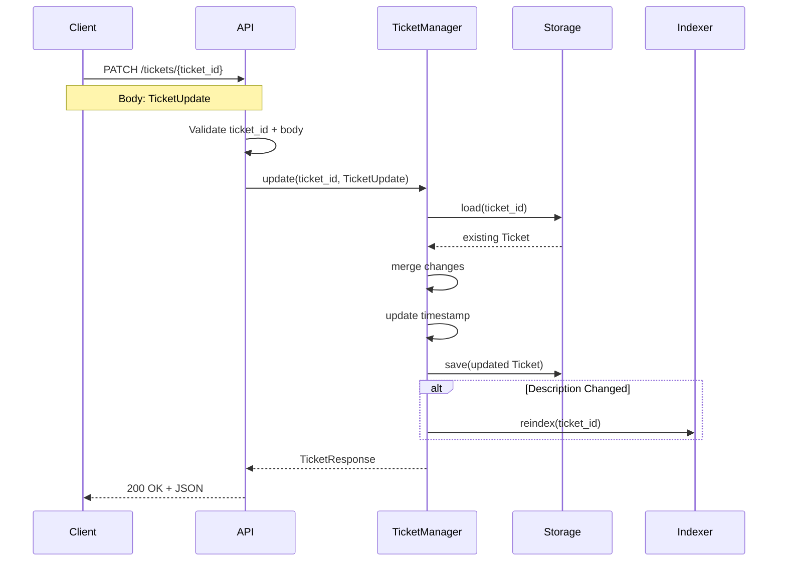
```mermaid
sequenceDiagram
    participant Client
    participant API
    participant TicketManager
    participant Storage
    participant Indexer

    Client->>API: PATCH /tickets/{ticket_id}
    Note over Client,API: Body: TicketUpdate
    API->>API: Validate ticket_id + body
    API->>TicketManager: update(ticket_id, TicketUpdate)
    
    TicketManager->>Storage: load(ticket_id)
    Storage-->>TicketManager: existing Ticket
    
    TicketManager->>TicketManager: merge changes
    TicketManager->>TicketManager: update timestamp
    
    TicketManager->>Storage: save(updated Ticket)
    
    alt Description Changed
        TicketManager->>Indexer: reindex(ticket_id)
    end
    
    TicketManager-->>API: TicketResponse
    API-->>Client: 200 OK + JSON
```

#### Level 2: Component Interactions

1. **API Layer**:
   - Validates `TicketUpdate` schema (all fields optional)
   - Validates `description` and `description_append` are mutually exclusive

2. **Core Layer**:
   - Loads existing ticket
   - Merges partial updates
   - Updates `updated` timestamp
   - Re-indexes if searchable content changed

#### Level 3: Data Structures

**Request Schema:**
```yaml
TicketUpdate:
  title: string | null (1-200 chars)
  description: string | null (replaces entire body)
  description_append: string | null (appends to existing)
  category: Category | null
  severity: Severity | null
  status: Status | null
  assignee: string | null (null unassigns)
  fix: string | null
  tags: string[] | null (replaces existing)
  references: string[] | null
```

**Example Request:**
```json
{
  "status": "fixed",
  "fix": "Updated Access-Control-Allow-Origin to domain whitelist"
}
```

---

### 4.5 Delete Ticket Flow

**Endpoint:** `DELETE /tickets/{ticket_id}`  
**Auth:** Required

#### Level 1: Request/Response

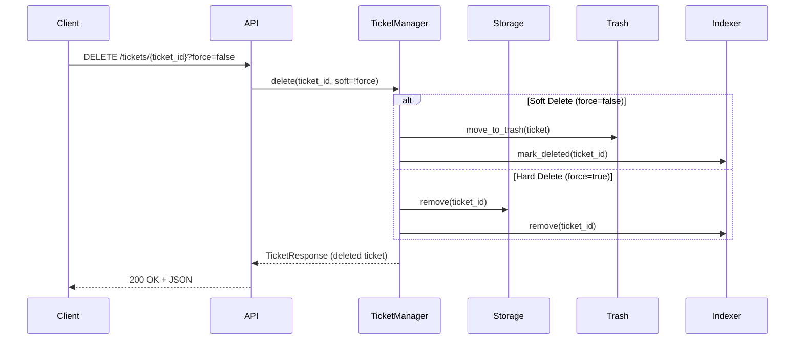
```mermaid
sequenceDiagram
    participant Client
    participant API
    participant TicketManager
    participant Storage
    participant Trash
    participant Indexer

    Client->>API: DELETE /tickets/{ticket_id}?force=false
    API->>TicketManager: delete(ticket_id, soft=!force)
    
    alt Soft Delete (force=false)
        TicketManager->>Trash: move_to_trash(ticket)
        TicketManager->>Indexer: mark_deleted(ticket_id)
    else Hard Delete (force=true)
        TicketManager->>Storage: remove(ticket_id)
        TicketManager->>Indexer: remove(ticket_id)
    end
    
    TicketManager-->>API: TicketResponse (deleted ticket)
    API-->>Client: 200 OK + JSON
```

#### Level 2: Component Interactions

1. **API Layer**:
   - Validates `ticket_id` format
   - Parses `force` and `dry_run` query parameters

2. **Core Layer**:
   - Default: soft delete (move to trash)
   - `force=true`: permanent deletion
   - `dry_run=true`: preview without action

#### Level 3: Data Structures

**Query Parameters:**
```yaml
force: boolean (default: false)
dry_run: boolean (default: false)
```

---

### 4.6 Batch Get Tickets Flow

**Endpoint:** `POST /tickets/batch`  
**Auth:** Required

#### Level 1: Request/Response

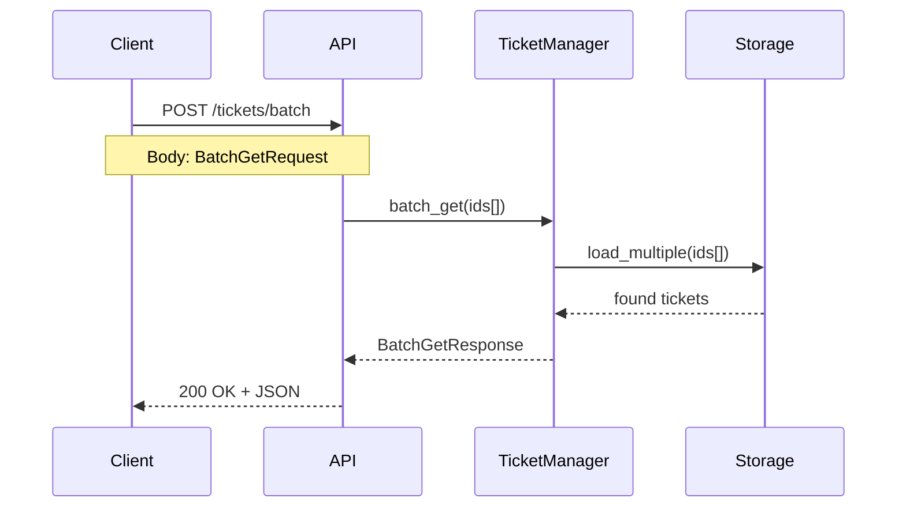
```mermaid
sequenceDiagram
    participant Client
    participant API
    participant TicketManager
    participant Storage

    Client->>API: POST /tickets/batch
    Note over Client,API: Body: BatchGetRequest
    API->>TicketManager: batch_get(ids[])
    TicketManager->>Storage: load_multiple(ids[])
    Storage-->>TicketManager: found tickets
    TicketManager-->>API: BatchGetResponse
    API-->>Client: 200 OK + JSON
```

#### Level 3: Data Structures

**Request Schema:**
```yaml
BatchGetRequest:
  ids: string[] (1-100 IDs, pattern: ^[CFGHST]\d+$)
  fields: string[] | null (field projection, null = full tickets)
```

**Response Schema:**
```yaml
BatchGetResponse:
  data: Ticket[]
  meta:
    requested: integer
    found: integer
    missing: string[]
    request_id: string
```

**Example Request:**
```json
{
  "ids": ["C1", "C2", "F12"],
  "fields": ["id", "title", "status", "severity"]
}
```

---

## 5. Stage 2: Search Operations

### 5.1 Hybrid Search Flow

**Endpoint:** `POST /search`  
**Auth:** Required

#### Level 1: Request/Response

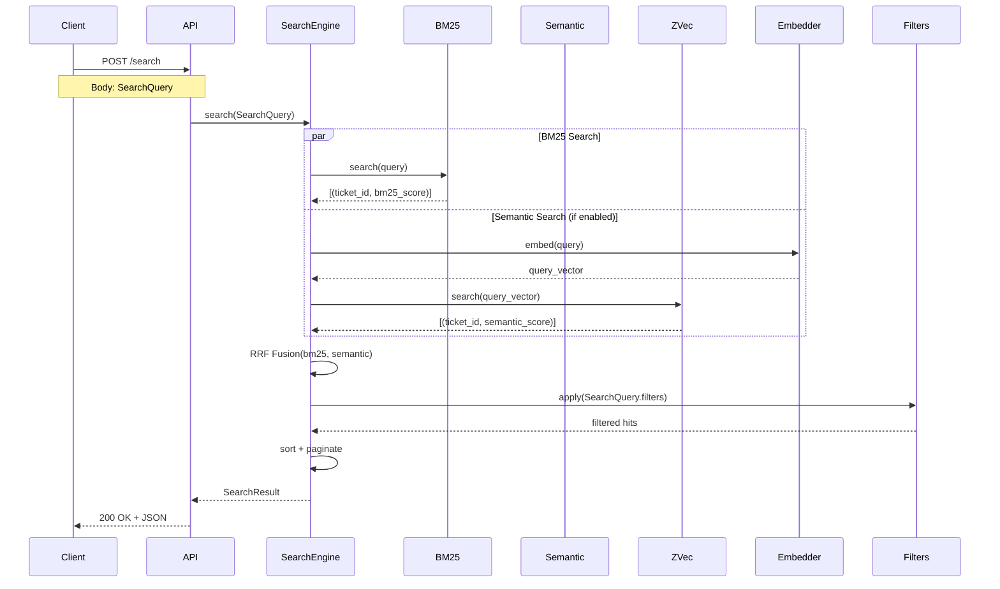
```mermaid
sequenceDiagram
    participant Client
    participant API
    participant SearchEngine
    participant BM25
    participant Semantic
    participant ZVec
    participant Embedder
    participant Filters

    Client->>API: POST /search
    Note over Client,API: Body: SearchQuery
    API->>SearchEngine: search(SearchQuery)
    
    par BM25 Search
        SearchEngine->>BM25: search(query)
        BM25-->>SearchEngine: [(ticket_id, bm25_score)]
    and Semantic Search (if enabled)
        SearchEngine->>Embedder: embed(query)
        Embedder-->>SearchEngine: query_vector
        SearchEngine->>ZVec: search(query_vector)
        ZVec-->>SearchEngine: [(ticket_id, semantic_score)]
    end
    
    SearchEngine->>SearchEngine: RRF Fusion(bm25, semantic)
    SearchEngine->>Filters: apply(SearchQuery.filters)
    Filters-->>SearchEngine: filtered hits
    
    SearchEngine->>SearchEngine: sort + paginate
    SearchEngine-->>API: SearchResult
    API-->>Client: 200 OK + JSON
```

#### Level 2: Component Interactions

1. **API Layer** (`api/routes/search.py`):
   - Validates `SearchQuery` schema
   - Extracts `explain` parameter
   - Returns 400 if query empty

2. **Core Layer** (`search/engine.py`):
   - Orchestrates BM25 + semantic search
   - Applies Reciprocal Rank Fusion (RRF)
   - Post-filters results
   - Sorts and paginates

3. **BM25 Layer** (`search/bm25.py`):
   - Tokenizes query
   - Scores documents using Okapi BM25
   - Returns ranked list with scores

4. **Semantic Layer** (`search/semantic.py`):
   - Embeds query via configured provider
   - Searches ZVec index for similar vectors
   - Returns ranked list with cosine similarity scores

5. **Filter Layer** (`search/filters.py`):
   - Applies `FilterSet` to results
   - Supports multi-select via arrays

#### Level 3: Data Structures

**Request Schema:**
```yaml
SearchQuery:
  query: string (required, 1-500 chars)
  semantic: boolean (default: false)
  filters: FilterSet | null
  limit: integer (default: 20, min: 1, max: 100)
  offset: integer (default: 0, min: 0)
  sort: string (default: -score)
  min_score: number | null (0-1)
```

**FilterSet Schema:**
```yaml
FilterSet:
  severity: Severity[] | null
  status: Status[] | null
  repo: string[] | null (supports glob patterns)
  category: Category[] | null
  assignee: string | null
  tags: string[] | null (AND logic)
  created_after: datetime | null
  created_before: datetime | null
  updated_after: datetime | null
```

**SearchHit Schema:**
```yaml
SearchHit:
  ticket_id: string
  score: number (fused relevance score)
  source: bm25 | semantic | hybrid
  bm25_score: number | null (explain mode only)
  semantic_score: number | null (explain mode only)
  highlight: string | null
```

**Response Schema:**
```yaml
SearchResult:
  query: string
  hits: SearchHit[]
  total: integer
  meta:
    bm25_weight: number
    semantic_weight: number
    latency_ms: integer
    semantic_used: boolean
    request_id: string
  request_id: string
```

**Example Request:**
```json
{
  "query": "authentication failure after password reset",
  "semantic": true,
  "filters": {
    "severity": ["critical", "high"],
    "status": ["open", "in_progress"],
    "repo": ["ejacklab/open-dsearch"]
  },
  "limit": 10,
  "offset": 0,
  "sort": "-score"
}
```

**Example Response:**
```json
{
  "query": "authentication failure after password reset",
  "hits": [
    {
      "ticket_id": "C1",
      "score": 0.034,
      "source": "hybrid",
      "highlight": "The API allows wildcard CORS origins..."
    },
    {
      "ticket_id": "C5",
      "score": 0.028,
      "source": "hybrid",
      "highlight": "Authentication fails after password reset..."
    }
  ],
  "total": 15,
  "meta": {
    "bm25_weight": 0.6,
    "semantic_weight": 0.4,
    "latency_ms": 45,
    "semantic_used": true,
    "request_id": "req_abc123"
  },
  "request_id": "req_abc123"
}
```

---

### 5.2 Search Suggestions Flow

**Endpoint:** `GET /search/suggest`  
**Auth:** Required

#### Level 1: Request/Response

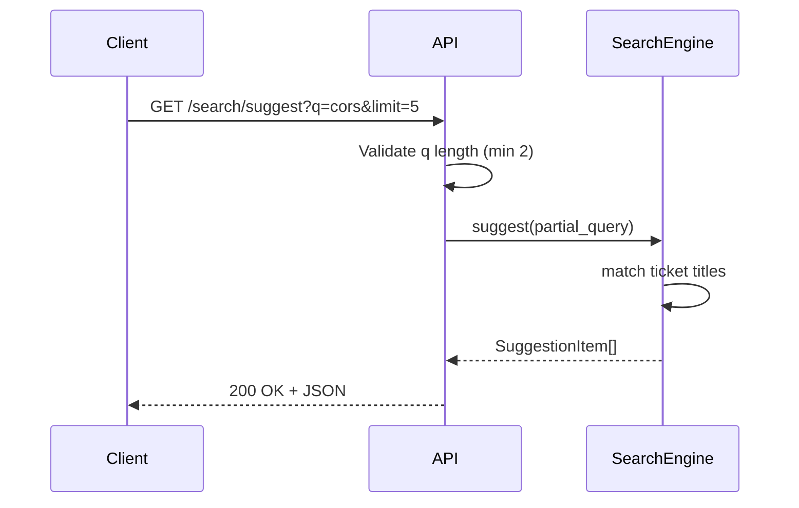
```mermaid
sequenceDiagram
    participant Client
    participant API
    participant SearchEngine

    Client->>API: GET /search/suggest?q=cors&limit=5
    API->>API: Validate q length (min 2)
    API->>SearchEngine: suggest(partial_query)
    SearchEngine->>SearchEngine: match ticket titles
    SearchEngine-->>API: SuggestionItem[]
    API-->>Client: 200 OK + JSON
```

#### Level 3: Data Structures

**Query Parameters:**
```yaml
q: string (required, min: 2, max: 100)
limit: integer (default: 5, min: 1, max: 20)
```

**SuggestionItem Schema:**
```yaml
SuggestionItem:
  suggestion: string
  ticket_count: integer
```

**Example Response:**
```json
[
  { "suggestion": "CORS wildcard issue", "ticket_count": 3 },
  { "suggestion": "CORS configuration error", "ticket_count": 2 },
  { "suggestion": "CORS preflight timeout", "ticket_count": 1 }
]
```

---

## 6. Stage 3: Bulk Operations

### 6.1 Bulk Create Flow

**Endpoint:** `POST /tickets/bulk`  
**Auth:** Required

#### Level 1: Request/Response

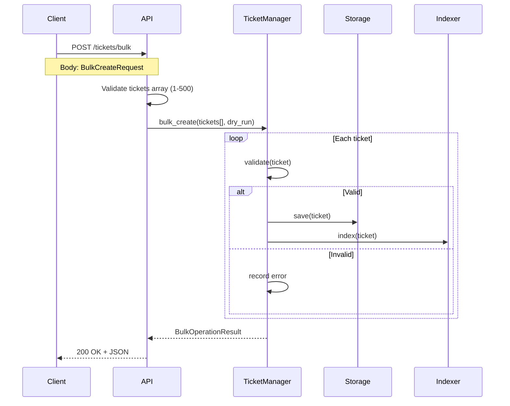
```mermaid
sequenceDiagram
    participant Client
    participant API
    participant TicketManager
    participant Storage
    participant Indexer

    Client->>API: POST /tickets/bulk
    Note over Client,API: Body: BulkCreateRequest
    API->>API: Validate tickets array (1-500)
    API->>TicketManager: bulk_create(tickets[], dry_run)
    
    loop Each ticket
        TicketManager->>TicketManager: validate(ticket)
        alt Valid
            TicketManager->>Storage: save(ticket)
            TicketManager->>Indexer: index(ticket)
        else Invalid
            TicketManager->>TicketManager: record error
        end
    end
    
    TicketManager-->>API: BulkOperationResult
    API-->>Client: 200 OK + JSON
```

#### Level 3: Data Structures

**Request Schema:**
```yaml
BulkCreateRequest:
  tickets: TicketCreate[] (1-500 items)
  dry_run: boolean (default: false)
```

**Response Schema:**
```yaml
BulkOperationResult:
  total: integer
  succeeded: integer
  failed: integer
  results:
    - index: integer
      ticket_id: string | null
      status: created | updated | deleted | error
      error: string | null
  request_id: string
```

---

### 6.2 Bulk Update Flow

**Endpoint:** `PATCH /tickets/bulk`  
**Auth:** Required

#### Level 1: Request/Response

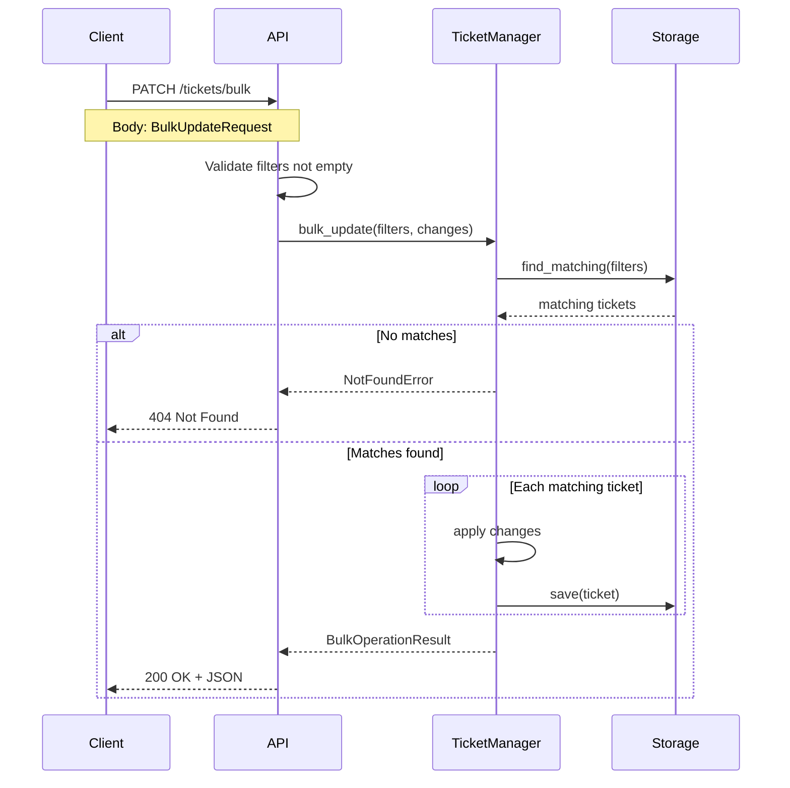
```mermaid
sequenceDiagram
    participant Client
    participant API
    participant TicketManager
    participant Storage

    Client->>API: PATCH /tickets/bulk
    Note over Client,API: Body: BulkUpdateRequest
    API->>API: Validate filters not empty
    API->>TicketManager: bulk_update(filters, changes)
    
    TicketManager->>Storage: find_matching(filters)
    Storage-->>TicketManager: matching tickets
    
    alt No matches
        TicketManager-->>API: NotFoundError
        API-->>Client: 404 Not Found
    else Matches found
        loop Each matching ticket
            TicketManager->>TicketManager: apply changes
            TicketManager->>Storage: save(ticket)
        end
        TicketManager-->>API: BulkOperationResult
        API-->>Client: 200 OK + JSON
    end
```

#### Level 3: Data Structures

**Request Schema:**
```yaml
BulkUpdateRequest:
  filters: FilterSet (at least one field required)
  changes: TicketUpdate
  dry_run: boolean (default: false)
```

**Example Request:**
```json
{
  "filters": {
    "status": ["open"],
    "category": ["crash"]
  },
  "changes": {
    "severity": "critical"
  }
}
```

---

### 6.3 Bulk Delete Flow

**Endpoint:** `DELETE /tickets/bulk`  
**Auth:** Required

#### Level 1: Request/Response

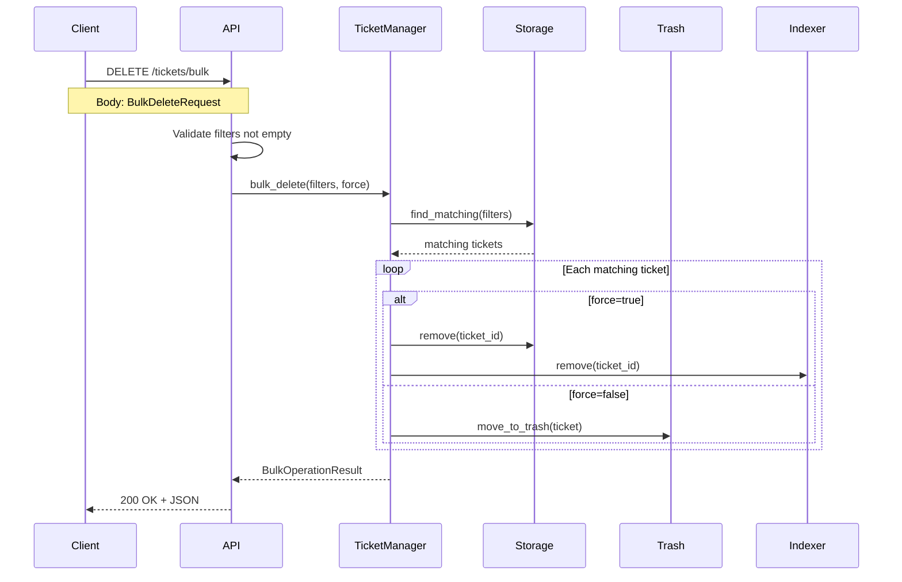
```mermaid
sequenceDiagram
    participant Client
    participant API
    participant TicketManager
    participant Storage
    participant Trash
    participant Indexer

    Client->>API: DELETE /tickets/bulk
    Note over Client,API: Body: BulkDeleteRequest
    API->>API: Validate filters not empty
    API->>TicketManager: bulk_delete(filters, force)
    
    TicketManager->>Storage: find_matching(filters)
    Storage-->>TicketManager: matching tickets
    
    loop Each matching ticket
        alt force=true
            TicketManager->>Storage: remove(ticket_id)
            TicketManager->>Indexer: remove(ticket_id)
        else force=false
            TicketManager->>Trash: move_to_trash(ticket)
        end
    end
    
    TicketManager-->>API: BulkOperationResult
    API-->>Client: 200 OK + JSON
```

#### Level 3: Data Structures

**Request Schema:**
```yaml
BulkDeleteRequest:
  filters: FilterSet (at least one field required)
  force: boolean (default: false, hard delete if true)
  dry_run: boolean (default: false)
```

---

## 7. Import/Export Flows

### 7.1 Export Flow

**Endpoint:** `GET /export`  
**Auth:** Required

#### Level 1: Request/Response

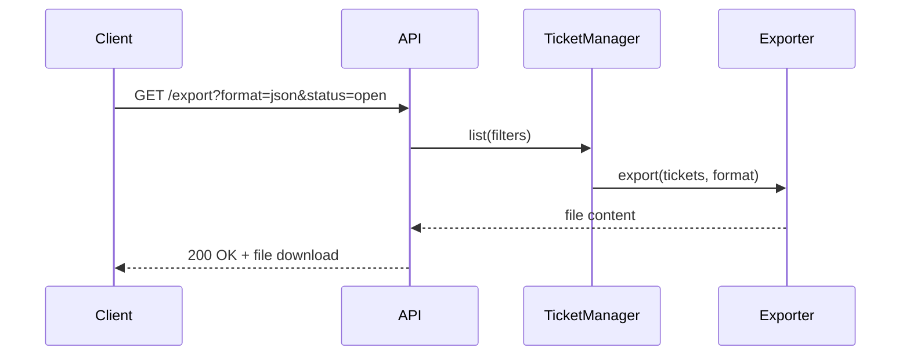
```mermaid
sequenceDiagram
    participant Client
    participant API
    participant TicketManager
    participant Exporter

    Client->>API: GET /export?format=json&status=open
    API->>TicketManager: list(filters)
    TicketManager->>Exporter: export(tickets, format)
    Exporter-->>API: file content
    API-->>Client: 200 OK + file download
```

#### Level 3: Data Structures

**Query Parameters:**
```yaml
format: json | jsonl | csv | markdown | tar.gz (default: json)
severity: Severity[]
status: Status[]
category: Category[]
repo: string[] (supports glob)
```

**Response Headers:**
```yaml
Content-Disposition: attachment; filename="vtic-export.json"
```

---

### 7.2 Import Flow

**Endpoint:** `POST /import`  
**Auth:** Required

#### Level 1: Request/Response

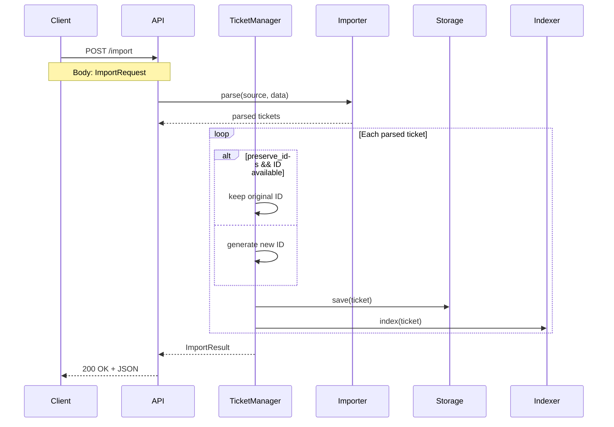
```mermaid
sequenceDiagram
    participant Client
    participant API
    participant TicketManager
    participant Importer
    participant Storage
    participant Indexer

    Client->>API: POST /import
    Note over Client,API: Body: ImportRequest
    API->>Importer: parse(source, data)
    Importer-->>API: parsed tickets
    
    loop Each parsed ticket
        alt preserve_ids && ID available
            TicketManager->>TicketManager: keep original ID
        else
            TicketManager->>TicketManager: generate new ID
        end
        
        TicketManager->>Storage: save(ticket)
        TicketManager->>Indexer: index(ticket)
    end
    
    TicketManager-->>API: ImportResult
    API-->>Client: 200 OK + JSON
```

#### Level 3: Data Structures

**Request Schema:**
```yaml
ImportRequest:
  source: json | csv | markdown | github | jira
  data: string | null (inline data)
  url: string | null (URL to import file)
  repo_mapping: {old: new} | null
  preserve_ids: boolean (default: false)
  dry_run: boolean (default: false)
```

**Response Schema:**
```yaml
ImportResult:
  total: integer
  imported: integer
  skipped: integer (duplicates)
  failed: integer
  id_mapping: {old_id: new_id} | null
  request_id: string
```

---

## 8. Management Flows

### 8.1 Reindex Flow

**Endpoint:** `POST /reindex`  
**Auth:** Required

#### Level 1: Request/Response

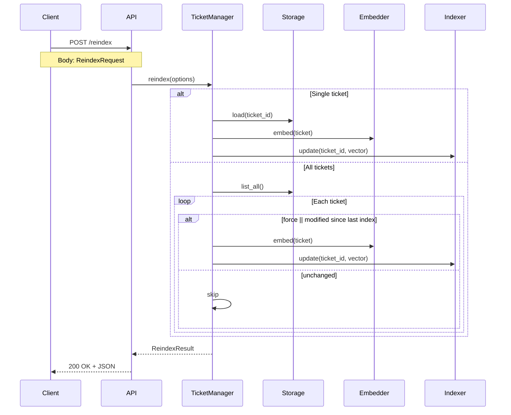
```mermaid
sequenceDiagram
    participant Client
    participant API
    participant TicketManager
    participant Storage
    participant Embedder
    participant Indexer

    Client->>API: POST /reindex
    Note over Client,API: Body: ReindexRequest
    API->>TicketManager: reindex(options)
    
    alt Single ticket
        TicketManager->>Storage: load(ticket_id)
        TicketManager->>Embedder: embed(ticket)
        TicketManager->>Indexer: update(ticket_id, vector)
    else All tickets
        TicketManager->>Storage: list_all()
        loop Each ticket
            alt force || modified since last index
                TicketManager->>Embedder: embed(ticket)
                TicketManager->>Indexer: update(ticket_id, vector)
            else unchanged
                TicketManager->>TicketManager: skip
            end
        end
    end
    
    TicketManager-->>API: ReindexResult
    API-->>Client: 200 OK + JSON
```

#### Level 3: Data Structures

**Request Schema:**
```yaml
ReindexRequest:
  ticket_id: string | null (single ticket, null = all)
  force: boolean (default: false, re-embed all if true)
  provider: EmbeddingProvider | null (override provider)
```

**Response Schema:**
```yaml
ReindexResult:
  processed: integer
  skipped: integer
  failed: integer
  duration_ms: integer
  errors:
    - ticket_id: string
      message: string
  request_id: string
```

**Example Response:**
```json
{
  "processed": 80,
  "skipped": 2,
  "failed": 0,
  "duration_ms": 12340,
  "errors": [],
  "request_id": "req_abc123"
}
```

---

### 8.2 Statistics Flow

**Endpoint:** `GET /stats`  
**Auth:** Required

#### Level 1: Request/Response

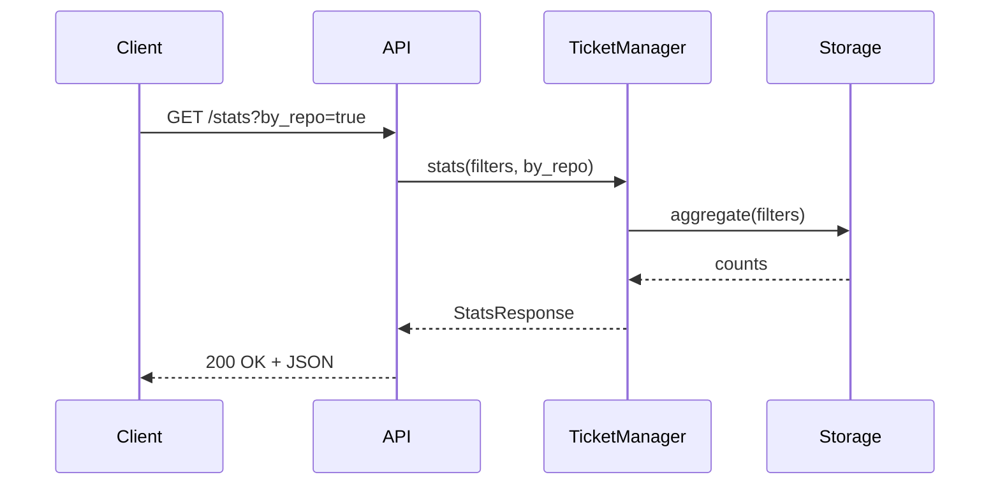
```mermaid
sequenceDiagram
    participant Client
    participant API
    participant TicketManager
    participant Storage

    Client->>API: GET /stats?by_repo=true
    API->>TicketManager: stats(filters, by_repo)
    TicketManager->>Storage: aggregate(filters)
    Storage-->>TicketManager: counts
    TicketManager-->>API: StatsResponse
    API-->>Client: 200 OK + JSON
```

#### Level 3: Data Structures

**Query Parameters:**
```yaml
by_repo: boolean (default: false)
severity: Severity[]
status: Status[]
category: Category[]
```

**Response Schema:**
```yaml
StatsResponse:
  totals:
    all: integer
    open: integer (open + in_progress)
    closed: integer (fixed + wont_fix + closed)
  by_status: {status: count}
  by_severity: {severity: count}
  by_category: {category: count}
  by_repo: {repo: count} | null
  date_range:
    earliest: datetime | null
    latest: datetime | null
  request_id: string
```

**Example Response:**
```json
{
  "totals": {
    "all": 82,
    "open": 23,
    "closed": 59
  },
  "by_status": {
    "open": 15,
    "in_progress": 8,
    "blocked": 2,
    "fixed": 42,
    "wont_fix": 3,
    "closed": 12
  },
  "by_severity": {
    "critical": 2,
    "high": 10,
    "medium": 35,
    "low": 25,
    "info": 10
  },
  "by_category": {
    "crash": 8,
    "hotfix": 5,
    "feature": 22,
    "security": 12,
    "general": 35
  },
  "by_repo": {
    "ejacklab/open-dsearch": 45,
    "ejacklab/vtic": 25,
    "ejacklab/zvec": 12
  },
  "request_id": "req_abc123"
}
```

---

### 8.3 Validation Flow

**Endpoint:** `GET /validate`  
**Auth:** Required

#### Level 1: Request/Response

```mermaid
sequenceDiagram
    participant Client
    participant API
    participant Validator
    participant Storage

    Client->>API: GET /validate
    API->>Validator: validate_all()
    Validator->>Storage: list_all()
    
    loop Each ticket
        Validator->>Validator: check schema
        Validator->>Validator: check required fields
        Validator->>Validator: check value constraints
    end
    
    Validator-->>API: ValidationResult
    API-->>Client: 200 OK + JSON
```

#### Level 3: Data Structures

**Response Schema:**
```yaml
ValidationResult:
  total: integer
  valid: integer
  invalid: integer
  errors:
    - ticket_id: string
      errors: string[]
  request_id: string
```

---

### 8.4 Trash Operations

#### List Trash Flow

**Endpoint:** `GET /trash`  
**Auth:** Required

**Query Parameters:**
```yaml
limit: integer (default: 20, max: 100)
offset: integer (default: 0)
```

**Response Schema:**
```yaml
TrashListResponse:
  data: TicketSummary[]
  meta:
    total: integer
    limit: integer
    offset: integer
    has_more: boolean
    request_id: string
```

#### Restore Ticket Flow

**Endpoint:** `POST /trash/{ticket_id}/restore`  
**Auth:** Required

**Path Parameter:**
```yaml
ticket_id: string (pattern: ^[CFGHST]\d+$)
```

#### Purge Trash Flow

**Endpoint:** `DELETE /trash/clean`  
**Auth:** Required

**Query Parameters:**
```yaml
older_than_days: integer (default: 30, min: 1)
```

**Response Schema:**
```yaml
TrashCleanResult:
  purged: integer
  request_id: string
```

---

## 9. Error Handling

### 9.1 Error Response Structure

All error responses follow a consistent structure:

```yaml
ErrorResponse:
  error:
    code: string (machine-readable)
    message: string (human-readable)
    details:
      - field: string
        message: string
        value: string | null
    docs: string | null (link to documentation)
  meta:
    request_id: string
```

### 9.2 Error Codes

| Code | HTTP Status | Description |
|------|-------------|-------------|
| `VALIDATION_ERROR` | 400 | Invalid request body or parameters |
| `NOT_FOUND` | 404 | Resource not found |
| `CONFLICT` | 409 | Resource conflict (e.g., duplicate ID) |
| `PAYLOAD_TOO_LARGE` | 413 | Request body exceeds size limit |
| `INTERNAL_ERROR` | 500 | Internal server error |
| `SERVICE_UNAVAILABLE` | 503 | Service temporarily unavailable |

### 9.3 Error Examples

**Validation Error:**
```json
{
  "error": {
    "code": "VALIDATION_ERROR",
    "message": "Missing required field: title",
    "details": [
      {
        "field": "title",
        "message": "Title is required and must be 1-200 characters",
        "value": null
      }
    ]
  }
}
```

**Not Found Error:**
```json
{
  "error": {
    "code": "NOT_FOUND",
    "message": "Ticket not found: C999",
    "details": []
  }
}
```

**Conflict Error:**
```json
{
  "error": {
    "code": "CONFLICT",
    "message": "Ticket with this ID already exists: C1",
    "details": []
  }
}
```

**Service Unavailable (no embedding provider):**
```json
{
  "error": {
    "code": "SERVICE_UNAVAILABLE",
    "message": "Semantic search requested but no embedding provider is configured",
    "details": [
      {
        "field": "semantic",
        "message": "Set 'semantic: false' or configure an embedding provider"
      }
    ],
    "docs": "https://vtic.ejai.ai/docs/semantic-search"
  }
}
```

---

## Appendix A: Enum Values

### Category Enum

```yaml
Category:
  - crash     # C prefix
  - hotfix    # H prefix
  - feature   # F prefix
  - security  # S prefix
  - general   # G prefix
```

### Severity Enum

```yaml
Severity:
  - critical
  - high
  - medium
  - low
  - info
```

### Status Enum

```yaml
Status:
  - open
  - in_progress
  - blocked
  - fixed
  - wont_fix
  - closed
```

### Embedding Provider Enum

```yaml
EmbeddingProvider:
  - local
  - openai
  - custom
  - none
```

### Search Source Enum

```yaml
SearchSource:
  - bm25      # Keyword match only
  - semantic  # Vector similarity only
  - hybrid    # Combined BM25 + semantic
```

---

## Appendix B: Sort Options

**Sort string format:** `{field}` for ascending, `-{field}` for descending

**Available sort fields:**
- `score` / `-score` (search only, default: `-score`)
- `created` / `-created` (default for list: `-created`)
- `updated` / `-updated`
- `severity` / `-severity`
- `title` / `-title`
- `status` / `-status`

---

## Appendix C: Filter Examples

**Multi-select filters (OR logic within field):**
```json
{
  "filters": {
    "severity": ["critical", "high"],
    "status": ["open", "in_progress"],
    "category": ["crash", "security"]
  }
}
```

**Glob pattern matching:**
```json
{
  "filters": {
    "repo": ["ejacklab/*"]
  }
}
```

**Date range filters:**
```json
{
  "filters": {
    "created_after": "2026-01-01T00:00:00Z",
    "created_before": "2026-03-31T23:59:59Z"
  }
}
```

**Combined filters (AND logic between fields):**
```json
{
  "filters": {
    "severity": ["critical"],
    "status": ["open"],
    "repo": ["ejacklab/open-dsearch"],
    "tags": ["security", "api"]
  }
}
```

---

*End of Detailed Data Flows Document*
