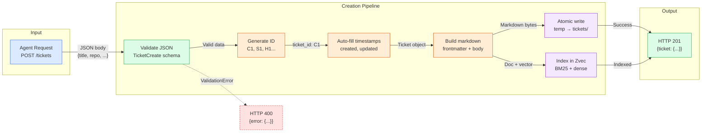
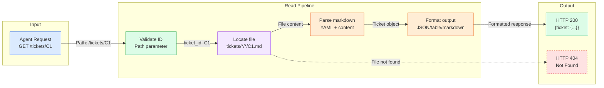
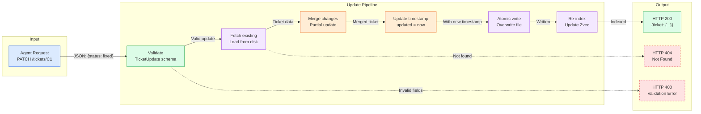
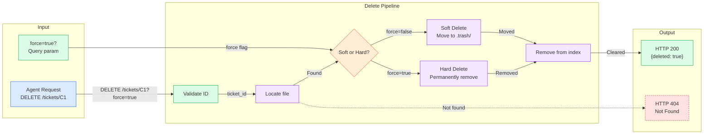
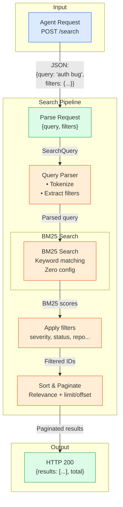
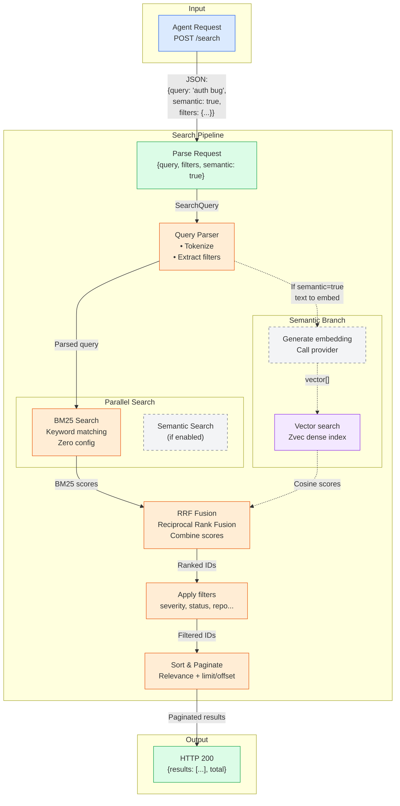
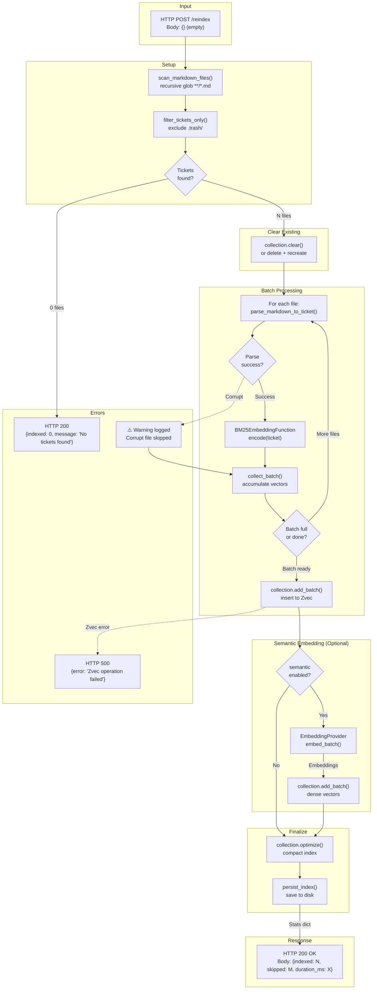
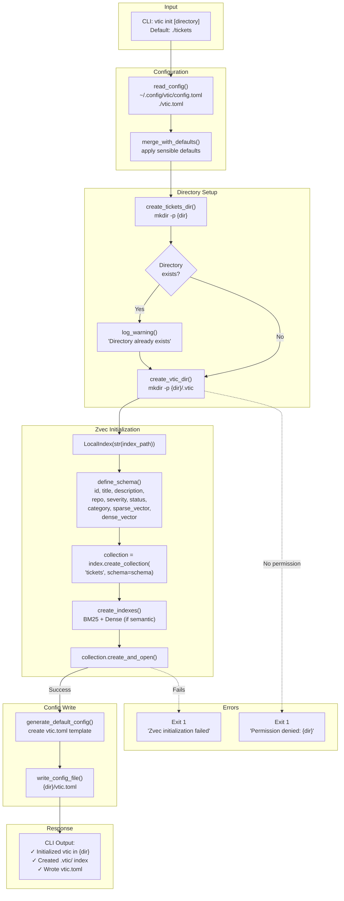
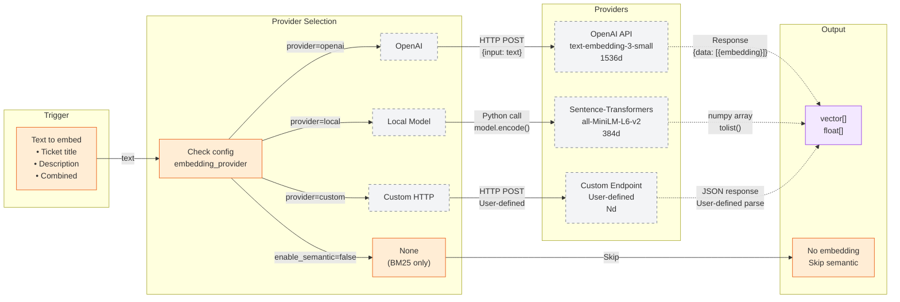

# vtic Data Flows - Complete Technical Breakdown

> Comprehensive 3-level documentation of all data flows in the vtic ticket management system.
> 
> **Generated:** 2026-03-18  
> **Version:** 1.0

---

## Table of Contents

1. [Level 1: System Overview](#level-1-system-overview)
2. [Level 2: Per-Operation Flows](#level-2-per-operation-flows)
   - [2.1 Create Ticket](#21-create-ticket-post-tickets)
   - [2.2 Read Ticket](#22-read-ticket-get-ticketsid)
   - [2.3 Update Ticket](#23-update-ticket-patch-ticketsid)
   - [2.4 Delete Ticket](#24-delete-ticket-delete-ticketsid)
   - [2.5 Search BM25](#25-search-bm25-post-search)
   - [2.6 Search Hybrid](#26-search-hybrid-post-search--semantic)
   - [2.7 Reindex](#27-reindex-post-reindex)
   - [2.8 Initialize](#28-initialize-vtic-init)
3. [Level 3: Step-by-Step Walkthroughs](#level-3-step-by-step-walkthroughs)
   - [3.1 Create Ticket Walkthrough](#31-create-ticket-walkthrough)
   - [3.2 Read Ticket Walkthrough](#32-read-ticket-walkthrough)
   - [3.3 Update Ticket Walkthrough](#33-update-ticket-walkthrough)
   - [3.4 Delete Ticket Walkthrough](#34-delete-ticket-walkthrough)
   - [3.5 Search BM25 Walkthrough](#35-search-bm25-walkthrough)
   - [3.6 Search Hybrid Walkthrough](#36-search-hybrid-walkthrough)
   - [3.7 Reindex Walkthrough](#37-reindex-walkthrough)
   - [3.8 Initialize Walkthrough](#38-initialize-walkthrough)
4. [Appendices](#appendices)

---

# Level 1: System Overview

A comprehensive view of the entire vtic architecture showing all components, data flows, and interactions.

```mermaid
flowchart TB
    %% ============================================
    %% LEGEND
    %% ============================================
    subgraph Legend["📋 Legend"]
        direction LR
        L1[Agent / User]:::agent
        L2[API Layer]:::api
        L3[Service]:::service
        L4[Storage]:::storage
        L5[Optional]:::optional
        
        L6["——→ Success Flow"]:::success
        L7["- - -→ Error Path"]:::error
        L8["-.-→ Optional Path"]:::optionalPath
        
        style Legend fill:#f8f9fa,stroke:#666,stroke-width:2px
    end

    %% ============================================
    %% AGENTS (Blue)
    %% ============================================
    subgraph Agents["👥 AI Agents (HTTP/JSON Clients)"]
        direction TB
        CCLow["🐈‍⬛ cclow<br/>Architecture & Ops"]:::agent
        Dave["👨‍💻 dave<br/>Backend Engineer"]:::agent
        Finan["📊 finan<br/>Finance & Analytics"]:::agent
        Ejack["🎯 Ejack<br/>Project Lead"]:::agent
    end

    %% ============================================
    %% API LAYER (Green)
    %% ============================================
    subgraph APILayer["🌐 FastAPI Server"]
        direction TB
        Router["Request Router<br/>• Path matching<br/>• Auth check"]:::api
        
        subgraph Endpoints["REST Endpoints"]
            POST_T["POST /tickets<br/>Create"]:::api
            GET_T["GET /tickets/:id<br/>Read"]:::api
            PATCH_T["PATCH /tickets/:id<br/>Update"]:::api
            DEL_T["DELETE /tickets/:id<br/>Delete"]:::api
            LIST_T["GET /tickets<br/>List"]:::api
            POST_S["POST /search<br/>Search"]:::api
            HEALTH["GET /health<br/>Health"]:::api
        end
        
        Validation["Pydantic Validation<br/>• Schema check<br/>• Type coercion"]:::api
        ErrorHandler["Error Handler<br/>• Exception catch<br/>• JSON error response"]:::api
    end

    %% ============================================
    %% SERVICES (Orange)
    %% ============================================
    subgraph Services["⚙️ Business Logic Services"]
        direction TB
        
        subgraph TicketSvc["Ticket Service (CRUD)"]
            CreateLogic["Create Logic<br/>• ID generation<br/>• Timestamp fill<br/>• Validation"]:::service
            ReadLogic["Read Logic<br/>• Fetch by ID<br/>• Format output"]:::service
            UpdateLogic["Update Logic<br/>• Partial update<br/>• Timestamp update"]:::service
            DeleteLogic["Delete Logic<br/>• Soft/hard delete<br/>• Trash management"]:::service
            ListLogic["List Logic<br/>• Filtering<br/>• Sorting<br/>• Pagination"]:::service
        end
        
        subgraph SearchSvc["Search Engine (Hybrid)"]
            QueryParser["Query Parser<br/>• Tokenize<br/>• Extract filters"]:::service
            BM25["BM25 Engine<br/>• Keyword search<br/>• Exact match<br/>• Built-in, zero config"]:::service
            HybridFusion["RRF Fusion<br/>• Combine scores<br/>• Rank results"]:::service
        end
    end

    %% ============================================
    %% EMBEDDING (Gray - Optional)
    %% ============================================
    subgraph Embedding["🔌 Embedding Provider (Optional)"]
        direction TB
        EmbedRouter["Provider Router"]:::optional
        OpenAI["OpenAI API<br/>text-embedding-3-small<br/>1536 dimensions"]:::optional
        LocalModel["Local Model<br/>sentence-transformers<br/>all-MiniLM-L6-v2"]:::optional
        CustomProvider["Custom HTTP<br/>Provider"]:::optional
    end

    %% ============================================
    %% STORAGE (Purple)
    %% ============================================
    subgraph Storage["💾 Storage Layer"]
        direction TB
        
        subgraph MarkdownStorage["📄 Markdown Files"]
            DirStructure["Directory Structure<br/>tickets/{owner}/{repo}/{category}/"]:::storage
            TicketFiles["Ticket Files<br/>{id}-{slug}.md"]:::storage
            TrashDir[".trash/<br/>(soft deleted)"]:::storage
        end
        
        subgraph ZvecIndex["🔍 Zvec Index"]
            BM25Index["BM25 Index<br/>(inverted index)"]:::storage
            DenseIndex["Dense Vector Index<br/>(optional)"]:::storage
            MetaIndex["Metadata Index<br/>(filters, sorting)"]:::storage
        end
    end

    %% ============================================
    %% DATA FLOWS
    %% ============================================
    
    %% Agents → API
    CCLow -->|"HTTP/JSON<br/>POST/GET/PATCH/DELETE"| Router
    Dave -->|"HTTP/JSON<br/>POST/GET/PATCH/DELETE"| Router
    Finan -->|"HTTP/JSON<br/>POST/GET/PATCH/DELETE"| Router
    Ejack -->|"HTTP/JSON<br/>POST/GET/PATCH/DELETE"| Router
    
    %% Router → Endpoints
    Router -->|"Route by path"| POST_T
    Router -->|"Route by path"| GET_T
    Router -->|"Route by path"| PATCH_T
    Router -->|"Route by path"| DEL_T
    Router -->|"Route by path"| LIST_T
    Router -->|"Route by path"| POST_S
    Router -->|"Route by path"| HEALTH
    
    %% Endpoints → Validation
    POST_T -->|"JSON payload"| Validation
    GET_T -->|"Path param"| Validation
    PATCH_T -->|"JSON payload"| Validation
    DEL_T -->|"Path param"| Validation
    LIST_T -->|"Query params"| Validation
    POST_S -->|"JSON payload"| Validation
    
    %% Validation → Error (dotted)
    Validation -.->|"ValidationError<br/>JSON error response"| ErrorHandler
    ErrorHandler -.->|"HTTP 400/422<br/>{error: {...}}"| Router
    
    %% Validation → Services
    Validation -->|"Valid request<br/>TicketCreate/Update/Search"| CreateLogic
    Validation -->|"Valid request<br/>ticket_id"| ReadLogic
    Validation -->|"Valid request<br/>TicketUpdate"| UpdateLogic
    Validation -->|"Valid request<br/>ticket_id, force"| DeleteLogic
    Validation -->|"Valid request<br/>FilterParams"| ListLogic
    Validation -->|"Valid request<br/>SearchQuery"| QueryParser
    
    %% Ticket Service → Storage
    CreateLogic -->|"Markdown content<br/>+ metadata"| DirStructure
    ReadLogic -->|"ticket_id"| TicketFiles
    UpdateLogic -->|"Updated markdown<br/>+ metadata"| TicketFiles
    DeleteLogic -->|"Move or delete"| TicketFiles
    DeleteLogic -->|"Soft delete target"| TrashDir
    ListLogic -->|"Filter criteria"| MetaIndex
    
    %% Create → ID Generator
    CreateLogic -->|"category, repo"| IDGen["ID Generator<br/>C1, S1, H1..."]:::service
    IDGen -->|"ticket_id"| CreateLogic
    
    %% Search Flow
    QueryParser -->|"Parsed query<br/>+ filters"| BM25
    QueryParser -.->|"If semantic enabled<br/>text to embed"| EmbedRouter
    
    EmbedRouter -.->|"HTTP/JSON<br/>API call"| OpenAI
    EmbedRouter -.->|"Local inference<br/>Python call"| LocalModel
    EmbedRouter -.->|"HTTP/JSON<br/>Custom endpoint"| CustomProvider
    
    OpenAI -.->|"vector[]<br/>1536 floats"| DenseIndex
    LocalModel -.->|"vector[]<br/>384 floats"| DenseIndex
    CustomProvider -.->|"vector[]<br/>n floats"| DenseIndex
    
    DenseIndex -.->|"semantic scores"| HybridFusion
    BM25 -->|"keyword scores"| HybridFusion
    HybridFusion -->|"merged results<br/>SearchResponse"| Router
    
    %% Storage → Service (returns)
    TicketFiles -->|"Ticket markdown<br/>parsed to object"| ReadLogic
    TicketFiles -->|"File content<br/>or None"| UpdateLogic
    DirStructure -->|"path created"| CreateLogic
    MetaIndex -->|"filtered IDs"| ListLogic
    
    %% Index Updates
    CreateLogic -->|"Index add<br/>doc + embedding"| BM25Index
    UpdateLogic -->|"Index update<br/>doc + embedding"| BM25Index
    DeleteLogic -->|"Index remove<br/>doc_id"| BM25Index
    
    CreateLogic -.->|"If semantic enabled<br/>vector + metadata"| DenseIndex
    UpdateLogic -.->|"If semantic enabled<br/>update vector"| DenseIndex
    DeleteLogic -.->|"Remove vector"| DenseIndex
    
    %% Error paths from services
    ReadLogic -.->|"TicketNotFound<br/>HTTP 404"| ErrorHandler
    UpdateLogic -.->|"TicketNotFound<br/>HTTP 404"| ErrorHandler
    DeleteLogic -.->|"TicketNotFound<br/>HTTP 404"| ErrorHandler
    
    %% Response flow
    CreateLogic -->|"Ticket JSON<br/>HTTP 201"| Router
    ReadLogic -->|"Ticket JSON<br/>HTTP 200"| Router
    HEALTH -->|"HTTP 200<br/>{status: ok}"| Router
    UpdateLogic -->|"Ticket JSON<br/>HTTP 200"| Router
    DeleteLogic -->|"Success JSON<br/>HTTP 200"| Router
    ListLogic -->|"Ticket[] JSON<br/>HTTP 200"| Router
    
    %% Legend to visual flow
    style Legend fill:#f8f9fa,stroke:#666,stroke-width:2px
    
    %% Class definitions
    classDef agent fill:#dbeafe,stroke:#2563eb,stroke-width:2px,color:#1e40af
    classDef api fill:#dcfce7,stroke:#16a34a,stroke-width:2px,color:#166534
    classDef service fill:#ffedd5,stroke:#ea580c,stroke-width:2px,color:#9a3412
    classDef storage fill:#f3e8ff,stroke:#9333ea,stroke-width:2px,color:#6b21a8
    classDef optional fill:#f3f4f6,stroke:#6b7280,stroke-width:2px,color:#374151,stroke-dasharray: 5 5
    classDef success stroke:#16a34a,stroke-width:2px
    classDef error stroke:#dc2626,stroke-width:2px,stroke-dasharray: 3 3
    classDef optionalPath stroke:#6b7280,stroke-width:2px,stroke-dasharray: 5 5
```



## Architecture Principles

| Principle | Description |
|-----------|-------------|
| **Local-First** | Markdown files are source of truth; Zvec is derived/cached |
| **Zero Config** | BM25 works out of the box; embeddings are optional |
| **Git Native** | File format optimized for version control |
| **Atomic Operations** | Writes are atomic (temp + rename) |
| **In-Process** | No external database server; Zvec runs in Python process |
| **Pluggable** | Bring your own embedding provider |
| **RESTful** | Standard HTTP methods with consistent JSON envelopes |

## Color/Line Convention Guide

| Element | Color | Usage |
|---------|-------|-------|
| **Agents/Users** | 🔵 Blue | External clients making HTTP requests |
| **API Layer** | 🟢 Green | FastAPI server, endpoints, routing |
| **Services** | 🟠 Orange | Business logic, CRUD, search algorithms |
| **Storage** | 🟣 Purple | Markdown files, Zvec index on disk |
| **Optional** | ⚪ Gray | Embedding providers, semantic search |
| **Success Flow** | —— Solid | Normal operation path |
| **Error Path** | - - Dotted | Error/exception handling |
| **Optional Path** | -.- Dash-dot | Only used when feature enabled |

## Data Formats by Connection

| Connection | Format | Description |
|------------|--------|-------------|
| Agents → API | HTTP/JSON | REST API calls with JSON payloads |
| Router → Validation | Python object | FastAPI request objects |
| Validation → Services | Pydantic models | Validated `TicketCreate`, `SearchQuery`, etc. |
| Services → Markdown | File I/O | Atomic write to `.md` temp → rename |
| Services → Zvec | Python API | Zvec in-process function calls |
| Embedding → Provider | HTTP/JSON or Python | OpenAI API or local model inference |
| Embedding → Zvec | `vector[]` | Float arrays (384-1536 dimensions) |

---

# Level 2: Per-Operation Flows

---

## 2.1 Create Ticket (POST /tickets)



**Data Transformations:**
1. `JSON → Pydantic` - Request body validated against `TicketCreate` schema
2. `Schema → Ticket` - Validated data becomes `Ticket` dataclass
3. `Ticket → Markdown` - Rendered to `.md` file with YAML frontmatter
4. `Ticket → Vector` - (Optional) Text embedded to float array for semantic search

---

## 2.2 Read Ticket (GET /tickets/:id)



**Data Transformations:**
1. `Path → ID` - Extract `C1` from URL path
2. `ID → File Path` - Resolve to `tickets/{owner}/{repo}/{category}/C1-*.md`
3. `Markdown → Object` - Parse YAML frontmatter + markdown body → `Ticket` dataclass
4. `Object → Response` - Serialize to requested format (JSON default)

---

## 2.3 Update Ticket (PATCH /tickets/:id)



**Data Transformations:**
1. `JSON Patch → Update Object` - Partial fields validated
2. `Existing + Update → Merged` - Only specified fields changed
3. `Merged → Markdown` - Re-rendered to file
4. `Re-index` - Update BM25 and (optionally) dense vectors

---

## 2.4 Delete Ticket (DELETE /tickets/:id)



**Data Transformations:**
- Soft: `tickets/.../C1.md` → `.trash/C1.md`
- Hard: File permanently deleted from filesystem
- Index: Document and vectors removed from Zvec

---

## 2.5 Search BM25 (POST /search)

Keyword-only search using BM25 algorithm. Zero configuration required.



**Data Transformations:**
1. `Query Text → Tokens` - BM25 tokenization
2. `Tokens → Doc IDs` - BM25 inverted index lookup
3. `IDs → Tickets` - Fetch full documents from markdown files

---

## 2.6 Search Hybrid (POST /search + semantic)

Combines BM25 keyword search with semantic vector search using RRF fusion.



**Data Transformations:**
1. `Query Text → Tokens` - BM25 tokenization
2. `Query Text → Vector` - Embedding provider → float array
3. `Tokens → Doc IDs` - BM25 inverted index lookup
4. `Vector → Doc IDs` - Dense vector similarity search
5. `Ranked Lists → Merged` - RRF (Reciprocal Rank Fusion) algorithm
6. `IDs → Tickets` - Fetch full documents from markdown files

---

## 2.7 Reindex (POST /reindex)

Rebuilds the entire Zvec index from markdown files.



---

## 2.8 Initialize (vtic init)

One-time setup of the vtic directory structure and Zvec index.



---

# Level 3: Step-by-Step Walkthroughs

---

## 3.1 Create Ticket Walkthrough

### Overview
Creates a new ticket with auto-generated ID, stores as markdown, indexes in Zvec.

### Step-by-Step Details

| Step | Module/Function | Input | Output | Success | Failure | Dependencies |
|------|-----------------|-------|--------|---------|---------|--------------|
| 1 | `FastAPI Router` | HTTP POST `/tickets` | Request object | Path matches | 404 if no route | None |
| 2 | `validate_request()` | JSON body | `TicketCreate` Pydantic model | All required fields present | **HTTP 400**: "Missing required field: {field}" | Pydantic |
| 3 | `validate_id_format()` | Path param `id` | Boolean | Regex `[A-Z]\d+` matches | **HTTP 400**: "Invalid ID format" | None |
| 4 | `generate_ticket_id()` | category, repo | String (e.g., "C1") | Unique ID generated | **HTTP 409**: "Duplicate ID: {id}" | Counter, existing IDs |
| 5 | `generate_slug()` | title | String (e.g., "cors-wildcard") | URL-safe slug created | - (always succeeds) | None |
| 6 | `auto_fill_timestamps()` | Ticket object | Ticket with `created`/`updated` | ISO8601 timestamps added | - (always succeeds) | datetime |
| 7 | `TicketPathResolver.ticket_to_path()` | Ticket object | `Path` object | Valid file path computed | - | None |
| 8 | `build_markdown_content()` | Ticket object | Markdown string | Valid YAML + body | - | YAML lib |
| 9 | `AtomicFileWriter.write()` | Path, Markdown | File on disk | Write temp → fsync → rename | **HTTP 500**: "File write failed" | Filesystem |
| 10 | `BM25EmbeddingFunction.encode()` | Ticket text | Sparse vector `{token: weight}` | Valid sparse vector | - (always succeeds) | Zvec |
| 11 | `collection.add()` | ID, sparse vector, metadata | Index entry | Added to BM25 index | **HTTP 500**: "Index operation failed" | Zvec |
| 12 | `EmbeddingProvider.embed()` *(optional)* | Ticket text | Dense vector `[float, ...]` | Valid dense vector | Logged warning, continue | HTTP/Python |
| 13 | `collection.add()` *(optional)* | Dense vector | Index entry | Added to dense index | Logged warning, continue | Zvec |
| 14 | `format_response()` | Ticket object | JSON response | HTTP 201 with Location header | - | None |

### Input Data Format

```json
{
  "title": "CORS Wildcard in Production",
  "repo": "ejacklab/open-dsearch",
  "category": "security",
  "severity": "critical",
  "status": "open",
  "description": "All FastAPI services use allow_origins=['*']...",
  "fix": "Use ALLOWED_ORIGINS from env...",
  "tags": ["cors", "security", "fastapi"],
  "file_refs": ["backend/api-gateway/main.py:27-32"]
}
```

### Output Data Format

```json
{
  "data": {
    "ticket": {
      "id": "C1",
      "title": "CORS Wildcard in Production",
      "repo": "ejacklab/open-dsearch",
      "category": "security",
      "severity": "critical",
      "status": "open",
      "description": "All FastAPI services use allow_origins=['*']...",
      "fix": "Use ALLOWED_ORIGINS from env...",
      "tags": ["cors", "security", "fastapi"],
      "file_refs": ["backend/api-gateway/main.py:27-32"],
      "created": "2026-03-18T01:45:00Z",
      "updated": "2026-03-18T01:45:00Z"
    }
  }
}
```

### Storage Operations

| Operation | Path | Content |
|-----------|------|---------|
| Atomic Write | `tickets/{owner}/{repo}/{category}/{id}.md.tmp` → `{id}.md` | Full markdown with YAML frontmatter |
| Zvec Insert | `.vtic/zvec_index/collections/tickets` | BM25 sparse vector + metadata |
| Zvec Insert (opt) | `.vtic/zvec_index/collections/tickets` | Dense embedding vector |

---

## 3.2 Read Ticket Walkthrough

### Overview
Retrieves a single ticket by ID, using Zvec cache with file fallback.

### Step-by-Step Details

| Step | Module/Function | Input | Output | Success | Failure | Dependencies |
|------|-----------------|-------|--------|---------|---------|--------------|
| 1 | `FastAPI Router` | HTTP GET `/tickets/:id` | Request object | Path matches | 404 if no route | None |
| 2 | `validate_id_format()` | Path param `id` | Boolean | Regex `[A-Z]\d+` matches | **HTTP 400**: "Invalid ID format" | None |
| 3 | `collection.get()` | ticket_id | Metadata dict or None | Found in index | Returns None (continue to file) | Zvec |
| 4 | `TicketPathResolver.resolve_path()` *(fallback)* | ticket_id | `Path` object | Path computed | - | None |
| 5 | `read_file()` *(fallback)* | Path | Raw markdown string | File exists | **HTTP 404**: "Ticket not found" | Filesystem |
| 6 | `parse_markdown_to_ticket()` *(fallback)* | Markdown string | `Ticket` dataclass | Valid YAML + content | **HTTP 500**: "Parse error" | YAML lib |
| 7 | `format_response()` | Ticket object | JSON response | HTTP 200 | - | None |

### Input Data Format

```
GET /tickets/C1
```

### Output Data Format

```json
{
  "data": {
    "ticket": {
      "id": "C1",
      "title": "CORS Wildcard in Production",
      "repo": "ejacklab/open-dsearch",
      "category": "security",
      "severity": "critical",
      "status": "open",
      "description": "...",
      "fix": "...",
      "tags": ["cors", "security"],
      "file_refs": ["backend/api-gateway/main.py:27-32"],
      "created": "2026-03-18T01:45:00Z",
      "updated": "2026-03-18T01:45:00Z"
    }
  }
}
```

### Error Conditions

| Error | Condition | HTTP Status |
|-------|-----------|-------------|
| Invalid ID format | Regex mismatch `[A-Z]\d+` | 400 |
| Not found | Not in Zvec AND no file | 404 |

---

## 3.3 Update Ticket Walkthrough

### Overview
Partially updates an existing ticket, re-indexes if text fields change.

### Step-by-Step Details

| Step | Module/Function | Input | Output | Success | Failure | Dependencies |
|------|-----------------|-------|--------|---------|---------|--------------|
| 1 | `FastAPI Router` | HTTP PATCH `/tickets/:id` | Request object | Path matches | 404 if no route | None |
| 2 | `validate_id_format()` | Path param `id` | Boolean | Regex matches | **HTTP 400**: "Invalid ID format" | None |
| 3 | `get_ticket_by_id()` | ticket_id | `Ticket` object | Ticket exists | **HTTP 404**: "Ticket not found" | Zvec/File |
| 4 | `validate_updates()` | JSON patch fields | Boolean | No immutable fields modified | **HTTP 400**: "Cannot update immutable field: {field}" | None |
| 5 | `merge_updates()` | Existing ticket + updates | Merged `Ticket` | Fields merged correctly | - | None |
| 6 | `auto_fill_timestamps()` | Ticket object | Ticket with new `updated` | Timestamp updated | - | datetime |
| 7 | `AtomicFileWriter.write()` | Path, Markdown | File on disk | Atomic write succeeds | **HTTP 500**: "File write failed" | Filesystem |
| 8 | `collection.upsert()` | ID, metadata | Index entry | Metadata updated | **HTTP 500**: "Index operation failed" | Zvec |
| 9 | `check_text_changed()` *(optional)* | Old + new ticket | Boolean | Detects title/description change | - | None |
| 10 | `EmbeddingProvider.embed()` *(conditional)* | Ticket text | Dense vector | Valid embedding | Logged warning, continue | HTTP/Python |
| 11 | `collection.upsert()` *(conditional)* | Dense vector | Index entry | Dense vector updated | Logged warning, continue | Zvec |
| 12 | `format_response()` | Ticket object | JSON response | HTTP 200 | - | None |

### Immutable Fields

| Field | Reason |
|-------|--------|
| `id` | Primary identifier |
| `created` | Audit trail |
| `repo` | Ticket namespace |

### Semantic Re-embedding Triggers

| Field Changed | Re-embed? |
|---------------|-----------|
| `title` | ✅ Yes |
| `description` | ✅ Yes |
| `status` | ❌ No |
| `severity` | ❌ No |
| `tags` | ⚠️ Optional config |

### Input Data Format

```json
{
  "status": "fixed",
  "fix": "Updated CORS configuration with ALLOWED_ORIGINS env var"
}
```

### Output Data Format

```json
{
  "data": {
    "ticket": {
      "id": "C1",
      "title": "CORS Wildcard in Production",
      "status": "fixed",
      "fix": "Updated CORS configuration with ALLOWED_ORIGINS env var",
      "updated": "2026-03-18T02:30:00Z",
      "..."
    }
  }
}
```

---

## 3.4 Delete Ticket Walkthrough

### Overview
Removes ticket from filesystem (soft or hard) and Zvec index.

### Step-by-Step Details

| Step | Module/Function | Input | Output | Success | Failure | Dependencies |
|------|-----------------|-------|--------|---------|---------|--------------|
| 1 | `FastAPI Router` | HTTP DELETE `/tickets/:id?force=bool` | Request object | Path matches | 404 if no route | None |
| 2 | `validate_id_format()` | Path param `id` | Boolean | Regex matches | **HTTP 400**: "Invalid ID format" | None |
| 3 | `ticket_exists()` | ticket_id | Boolean | Ticket exists | **HTTP 404**: "Ticket not found" | Zvec/File |
| 4 | `check_force_param()` | Query param | Boolean | Determines delete mode | - | None |
| 5a | `ensure_trash_dir()` *(soft)* | None | `.trash/` directory | Directory created | **HTTP 500**: "Cannot create trash dir" | Filesystem |
| 5b | `move_to_trash()` *(soft)* | Source path | Destination path | File moved | **HTTP 500**: "Move failed" | Filesystem |
| 5c | `delete_file()` *(hard)* | Source path | None | File unlinked | **HTTP 500**: "Delete failed" | Filesystem |
| 6 | `collection.delete()` | ticket_id | None | Entry removed | **HTTP 500**: "Index delete failed" | Zvec |
| 7 | `format_response()` | ticket_id | JSON response | HTTP 200 | - | None |

### Delete Modes

| Mode | Parameter | Behavior | Recovery |
|------|-----------|----------|----------|
| Soft delete | (default) | Move to `.trash/` | `vtic restore {id}` |
| Hard delete | `?force=true` | Permanent removal | ❌ None |

### Input Data Format

```
DELETE /tickets/C1
DELETE /tickets/C1?force=true
```

### Output Data Format

```json
{
  "data": {
    "deleted": true,
    "id": "C1",
    "mode": "soft"
  }
}
```

### Storage Changes

| Operation | Source | Destination | Notes |
|-----------|--------|-------------|-------|
| Soft delete | `tickets/{o}/{r}/{c}/{id}.md` | `.trash/{id}-{ts}.md` | Timestamped backup |
| Hard delete | `tickets/{o}/{r}/{c}/{id}.md` | ❌ Removed | Irreversible |
| Zvec delete | Collection `tickets` | ❌ Removed | Index entry purged |

---

## 3.5 Search BM25 Walkthrough

### Overview
Keyword-only search using BM25 algorithm. Zero configuration required.

### Step-by-Step Details

| Step | Module/Function | Input | Output | Success | Failure | Dependencies |
|------|-----------------|-------|--------|---------|---------|--------------|
| 1 | `FastAPI Router` | HTTP POST `/search` | Request object | Path matches | 404 if no route | None |
| 2 | `parse_search_request()` | JSON body | `SearchQuery` model | Valid query structure | **HTTP 400**: "Invalid query syntax" | Pydantic |
| 3 | `build_filter_expression()` | filters dict | Zvec expression | Valid filter expression | - (empty if no filters) | None |
| 4 | `BM25EmbeddingFunction.encode()` | query string | Sparse vector | Valid sparse vector | - (always succeeds) | Zvec |
| 5 | `collection.query()` | Sparse vector + filters | SearchResult[] | Results returned | **HTTP 503**: "Index not initialized" | Zvec |
| 6 | `apply_pagination()` | Results, skip, topk | PaginatedResult | Correct slice returned | - | None |
| 7 | `fetch_full_tickets()` | List of IDs | List of Tickets | Tickets loaded | - | Zvec/File |
| 8 | `format_response()` | Results + meta | JSON response | HTTP 200 | - | None |

### Input Data Format

```json
{
  "query": "authentication security bug",
  "semantic": false,
  "filters": {
    "severity": "critical",
    "status": "open"
  },
  "topk": 10,
  "skip": 0
}
```

### Output Data Format

```json
{
  "data": {
    "results": [
      {
        "ticket": {
          "id": "C1",
          "title": "CORS Wildcard in Production",
          "..."
        },
        "score": 0.89,
        "bm25_score": 0.89
      }
    ],
    "total": 42
  },
  "meta": {
    "query": "authentication security bug",
    "took_ms": 23,
    "mode": "bm25"
  }
}
```

### Filter Expression Building

| Filter Type | Example Input | Zvec Expression |
|-------------|---------------|-----------------|
| Equality | `{"severity": "critical"}` | `severity == 'critical'` |
| IN list | `{"status": ["open", "in_progress"]}` | `status in ['open', 'in_progress']` |
| Combined | `{"severity": "high", "repo": "x/y"}` | `severity == 'high' and repo == 'x/y'` |

---

## 3.6 Search Hybrid Walkthrough

### Overview
Combines BM25 keyword search with semantic vector search using RRF fusion.

### Step-by-Step Details

| Step | Module/Function | Input | Output | Success | Failure | Dependencies |
|------|-----------------|-------|--------|---------|---------|--------------|
| 1 | `FastAPI Router` | HTTP POST `/search` | Request object | Path matches | 404 if no route | None |
| 2 | `parse_search_request()` | JSON body | `SearchQuery` model | Valid query structure | **HTTP 400**: "Invalid query syntax" | Pydantic |
| 3 | `build_filter_expression()` | filters dict | Zvec expression | Valid filter expression | - | None |
| 4 | `check_index_initialized()` | None | Boolean | Dense index ready | Continue with BM25 only | Zvec |
| 5a | `BM25EmbeddingFunction.encode()` | query string | Sparse vector | Valid sparse vector | - | Zvec |
| 5b | `collection.query()` | Sparse vector + filters | BM25 SearchResult[] | Results returned | **HTTP 503**: "Index not initialized" | Zvec |
| 6a | `EmbeddingProvider.embed_query()` | query string | Dense vector | Valid embedding | **HTTP 502**: "Embedding provider error" | HTTP/Python |
| 6b | `collection.query()` | Dense vector + filters | Semantic SearchResult[] | Results returned | Continue with BM25 only | Zvec |
| 7 | `WeightedReRanker.fuse_results()` | BM25 + Semantic results | Fused ranking | Combined scores computed | - | None |
| 8 | `apply_pagination()` | Results, skip, topk | PaginatedResult | Correct slice returned | - | None |
| 9 | `fetch_full_tickets()` | List of IDs | List of Tickets | Tickets loaded | - | Zvec/File |
| 10 | `format_response()` | Results + meta | JSON response | HTTP 200 | - | None |

### Fusion Scoring (WeightedReRanker)

```
final_score = (bm25_weight * bm25_score) + (semantic_weight * semantic_score)

Default weights:
  bm25_weight = 0.7
  semantic_weight = 0.3
```

### Input Data Format

```json
{
  "query": "authentication security bug",
  "semantic": true,
  "filters": {
    "severity": "critical",
    "status": "open"
  },
  "topk": 10,
  "skip": 0
}
```

### Output Data Format

```json
{
  "data": {
    "results": [
      {
        "ticket": {
          "id": "C1",
          "title": "CORS Wildcard in Production",
          "..."
        },
        "score": 0.87,
        "bm25_score": 0.89,
        "semantic_score": 0.82
      }
    ],
    "total": 42
  },
  "meta": {
    "query": "authentication security bug",
    "took_ms": 145,
    "mode": "hybrid",
    "fusion_weights": {
      "bm25": 0.7,
      "semantic": 0.3
    }
  }
}
```

---

## 3.7 Reindex Walkthrough

### Overview
Rebuilds the entire Zvec index from markdown files. Used for recovery or after bulk file changes.

### Step-by-Step Details

| Step | Module/Function | Input | Output | Success | Failure | Dependencies |
|------|-----------------|-------|--------|---------|---------|--------------|
| 1 | `FastAPI Router` | HTTP POST `/reindex` | Request object | Path matches | 404 if no route | None |
| 2 | `scan_markdown_files()` | tickets directory | List of Paths | Files found | Returns empty list | Filesystem |
| 3 | `filter_tickets_only()` | List of Paths | Filtered list | Excludes `.trash/`, non-tickets | - | None |
| 4 | `collection.clear()` | None | Empty collection | Index cleared | **HTTP 500**: "Zvec operation failed" | Zvec |
| 5 | `parse_markdown_to_ticket()` | Markdown file | `Ticket` object | Valid ticket | ⚠️ Warning logged, skip file | YAML lib |
| 6 | `BM25EmbeddingFunction.encode()` | Ticket text | Sparse vector | Valid vector | - | Zvec |
| 7 | `collect_batch()` | Ticket + vector | Batch accumulator | Batch ready or accumulating | - | Memory |
| 8 | `collection.add_batch()` | Batch of entries | Index updated | Batch inserted | **HTTP 500**: "Zvec operation failed" | Zvec |
| 9 | `EmbeddingProvider.embed_batch()` *(optional)* | Batch of texts | Batch of vectors | Embeddings generated | ⚠️ Warning logged, skip semantic | HTTP/Python |
| 10 | `collection.add_batch()` *(optional)* | Dense vectors | Index updated | Dense vectors added | ⚠️ Warning logged | Zvec |
| 11 | `collection.optimize()` | None | Optimized index | Index compacted | - | Zvec |
| 12 | `persist_index()` | None | Index on disk | Index saved | - | Filesystem |
| 13 | `format_response()` | Stats dict | JSON response | HTTP 200 | - | None |

### Batch Processing Parameters

| Parameter | Value | Purpose |
|-----------|-------|---------|
| Batch size | 100 | Balance memory vs. throughput |
| Parallel parsing | 4 workers | I/O bound operations |
| Retry on fail | 3 attempts | Handle transient errors |

### Input Data Format

```json
{}
```

### Output Data Format

```json
{
  "data": {
    "indexed": 156,
    "skipped": 3,
    "corrupt_files": [
      "tickets/x/y/z/bad.md"
    ],
    "duration_ms": 2340,
    "bm25_vectors": 156,
    "dense_vectors": 156
  }
}
```

### Storage Operations

| Step | Operation | Target |
|------|-----------|--------|
| Clear | Delete collection | `.vtic/zvec_index/collections/tickets` |
| Add | Batch insert | BM25 sparse vectors + metadata |
| Add (opt) | Batch insert | Dense embedding vectors |
| Optimize | Compact segments | Index storage |
| Persist | fsync | Disk persistence |

---

## 3.8 Initialize Walkthrough

### Overview
One-time setup of the vtic directory structure and Zvec index. Called via CLI.

### Step-by-Step Details

| Step | Module/Function | Input | Output | Success | Failure | Dependencies |
|------|-----------------|-------|--------|---------|---------|--------------|
| 1 | `CLI Parser` | `vtic init [directory]` | Args object | Command parsed | Exit 1 | argparse |
| 2 | `read_config()` | Global + local config paths | Config dict | Config loaded | Use defaults | toml lib |
| 3 | `merge_with_defaults()` | Config + defaults | Final config | Complete config | - | None |
| 4 | `create_tickets_dir()` | directory path | Directory created | mkdir succeeds | **Exit 1**: "Permission denied" | Filesystem |
| 5 | `create_vtic_dir()` | directory path | `.vtic/` created | mkdir succeeds | **Exit 1**: "Permission denied" | Filesystem |
| 6 | `LocalIndex()` | Index path | Zvec index object | Index created | **Exit 1**: "Zvec initialization failed" | Zvec |
| 7 | `define_schema()` | None | Schema definition | Schema built | - | None |
| 8 | `index.create_collection()` | "tickets", schema | Collection object | Collection created | **Exit 1**: "Zvec initialization failed" | Zvec |
| 9 | `create_indexes()` | Collection | BM25 + Dense indexes | Indexes created | **Exit 1**: "Zvec initialization failed" | Zvec |
| 10 | `collection.create_and_open()` | Collection | Open collection | Collection ready | **Exit 1**: "Zvec initialization failed" | Zvec |
| 11 | `generate_default_config()` | Final config | TOML string | Config template created | - | toml lib |
| 12 | `write_config_file()` | directory, TOML | `vtic.toml` file | File written | **Exit 1**: "Config write failed" | Filesystem |

### Default Directory Structure Created

```
{dir}/
├── tickets/          # Markdown ticket storage
│   └── (empty, ready for tickets)
├── .vtic/            # Hidden vtic metadata
│   ├── zvec_index/   # Zvec vector database
│   │   ├── collections/
│   │   │   └── tickets/
│   │   └── metadata.json
│   └── config.json   # Runtime config cache
└── vtic.toml         # User configuration file
```

### Default vtic.toml Template

```toml
# vtic configuration file
# Generated by vtic init

[tickets]
dir = "./tickets"

[search]
# BM25 is always enabled (zero config)
# Dense embeddings are optional
enable_semantic = false
# embedding_provider = "openai"
# embedding_model = "text-embedding-3-small"
# embedding_dimensions = 1536

[api]
host = "127.0.0.1"
port = 8900
```

### Zvec Schema Definition

| Field | Type | Index | Purpose |
|-------|------|-------|---------|
| `id` | string | Primary Key | Unique identifier |
| `title` | string | Filterable | Ticket title |
| `description` | text | BM25 indexed | Full-text search |
| `repo` | string | Filterable | Namespace |
| `severity` | string | Filterable | Critical/High/Medium/Low |
| `status` | string | Filterable | Open/Fixed/etc |
| `category` | string | Filterable | Code/Security/etc |
| `sparse_vector` | BM25 | Vector index | Keyword search |
| `dense_vector` | float[] | Vector index | Semantic search |

---

# Appendices

---

## Appendix A: HTTP Status Codes

| Code | When | Response Body |
|------|------|---------------|
| 200 | Success | `{data: {...}}` |
| 201 | Created | `{data: {ticket: {...}}}` |
| 400 | Bad Request (validation) | `{error: {code, message, details}}` |
| 404 | Not Found | `{error: {code: "TICKET_NOT_FOUND"}}` |
| 409 | Conflict (duplicate) | `{error: {code: "DUPLICATE_ID"}}` |
| 422 | Unprocessable Entity | `{error: {code, message, field_errors}}` |
| 500 | Internal Server Error | `{error: {code: "INTERNAL_ERROR"}}` |
| 502 | Bad Gateway (embedding) | `{error: {code: "EMBEDDING_PROVIDER_ERROR"}}` |
| 503 | Service Unavailable (index) | `{error: {code: "INDEX_NOT_INITIALIZED"}}` |

---

## Appendix B: Error Response Format

```json
{
  "error": {
    "code": "VALIDATION_ERROR",
    "message": "Request validation failed",
    "details": {
      "field_errors": [
        {
          "field": "title",
          "message": "Title is required",
          "code": "REQUIRED"
        }
      ]
    }
  }
}
```

---

## Appendix C: Data Format Reference

### Ticket JSON (API)

```json
{
  "id": "C1",
  "title": "CORS Wildcard in Production",
  "repo": "ejacklab/open-dsearch",
  "category": "security",
  "severity": "critical",
  "status": "open",
  "description": "All FastAPI services use allow_origins=['*']...",
  "fix": "Use ALLOWED_ORIGINS from env...",
  "tags": ["cors", "security", "fastapi"],
  "file_refs": ["backend/api-gateway/main.py:27-32"],
  "created": "2026-03-17T10:00:00Z",
  "updated": "2026-03-17T10:00:00Z"
}
```

### Ticket Markdown (Storage)

```markdown
# C1 - CORS Wildcard in Production

**Severity:** critical
**Status:** open
**Category:** security
**Repo:** ejacklab/open-dsearch
**File:** backend/api-gateway/main.py:27-32
**Created:** 2026-03-17
**Updated:** 2026-03-17

## Description
All FastAPI services use allow_origins=['*'] which enables CSRF attacks.

## Fix
Use ALLOWED_ORIGINS from environment variable.
```

### BM25 Sparse Vector

```python
{1024: 0.85, 2056: 0.72, 3072: 0.45}  # token_id: weight
```

### Dense Vector (Semantic)

```python
[0.023, -0.156, 0.789, ..., 0.042]  # 384 or 1536 floats
```

---

## Appendix D: Summary Table

| Endpoint | Markdown File | Zvec BM25 | Zvec Dense | Notes |
|----------|---------------|-----------|------------|-------|
| `POST /tickets` | ✅ Create (atomic) | ✅ Insert | ✅ Insert (opt) | Temp file + rename |
| `GET /tickets/:id` | ✅ Read (fallback) | ✅ Read | ❌ | Cache-first |
| `PATCH /tickets/:id` | ✅ Update (atomic) | ✅ Upsert | ✅ Upsert (opt) | Re-embed if text changes |
| `DELETE /tickets/:id` | ✅ Move/Delete | ✅ Delete | ✅ Delete | Soft or hard delete |
| `POST /search` | ❌ | ✅ Query | ✅ Query (opt) | BM25 always, dense optional |
| `POST /reindex` | ✅ Scan source | ✅ Recreate | ✅ Recreate (opt) | Full rebuild |
| `vtic init` | ✅ Create dir | ✅ Create collection | ✅ Create index | One-time setup |

---

## Appendix E: Embedding Provider Flow



### Data Transformations

| Provider | Input | Transform | Output |
|----------|-------|-----------|--------|
| OpenAI | Plain text | HTTP POST → JSON | `List[float]` (1536 dims) |
| Local | Plain text | `model.encode()` | `List[float]` (384 dims) |
| Custom | Plain text | User-defined | `List[float]` (N dims) |
| None | - | Skip | No embedding |

---

*End of vtic Data Flows Documentation*
