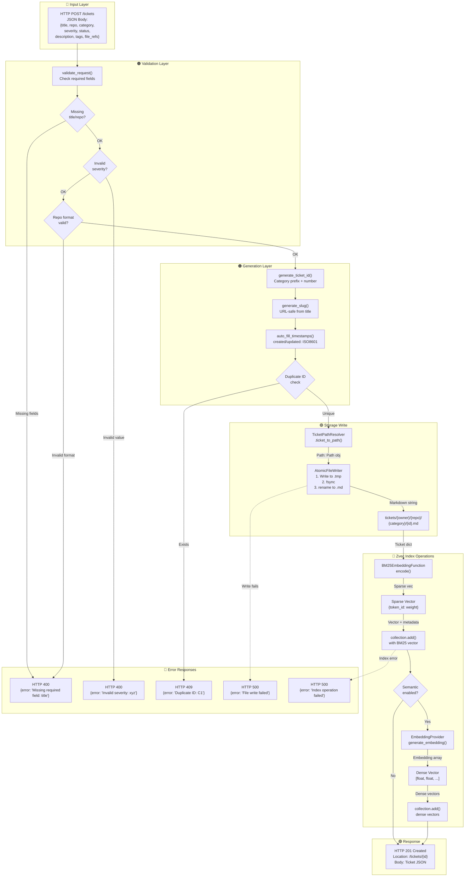
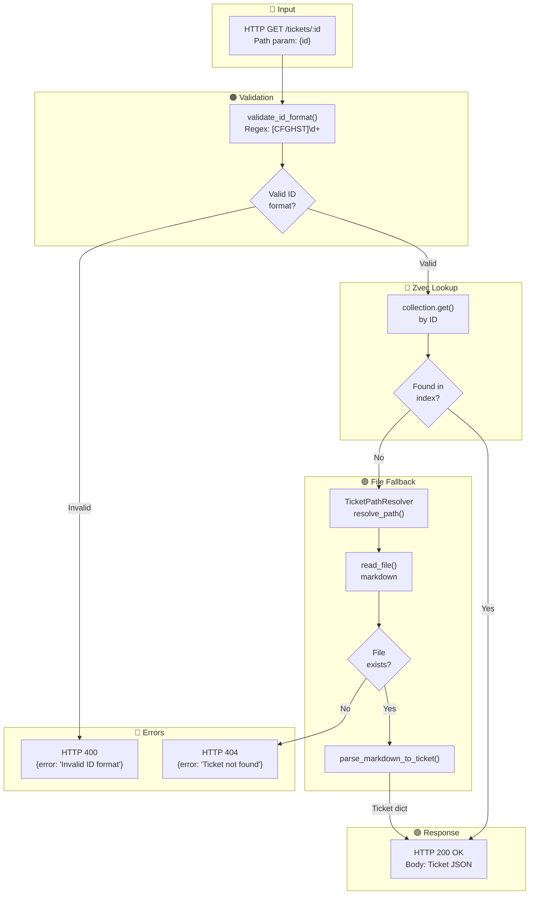
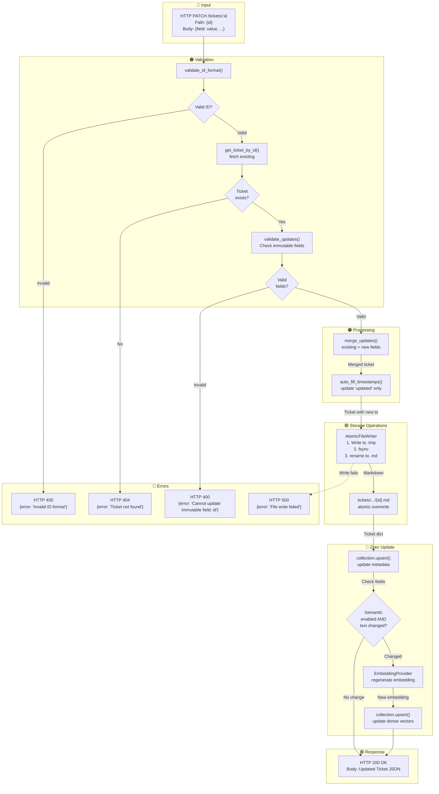
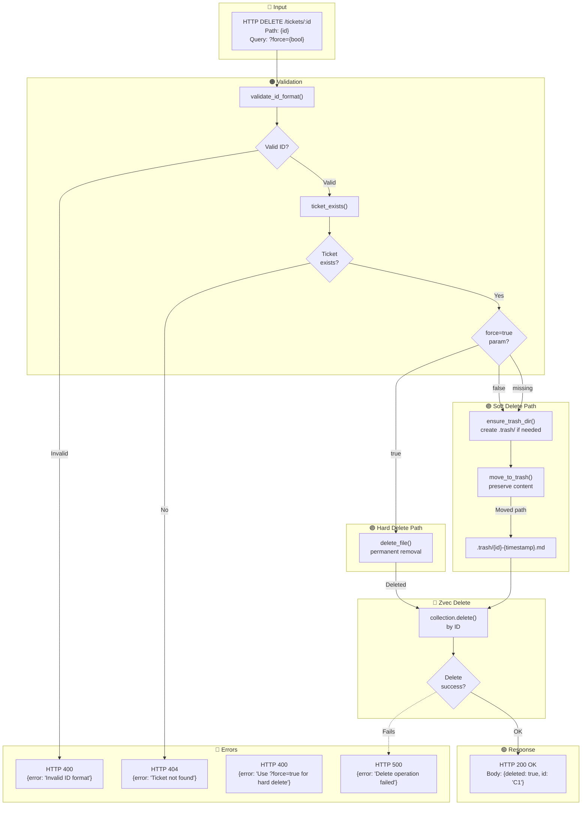
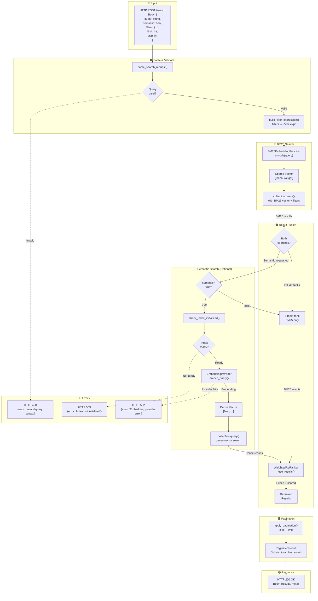
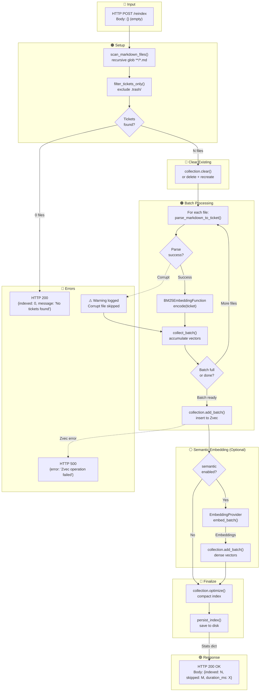
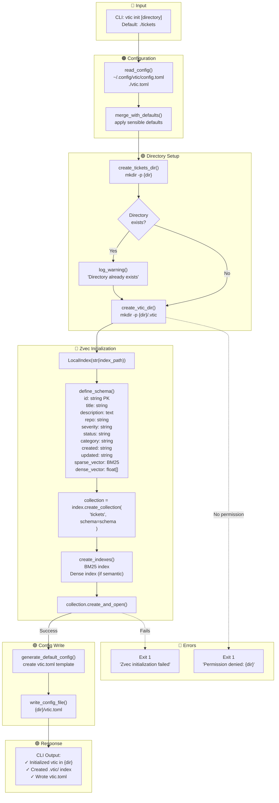

# vtic Data Flow Diagrams - API Operations

> Detailed data flow diagrams for all vtic operations showing exact steps, data formats, error paths, and storage operations.

---

## Diagram Legend

| Color | Meaning | Usage |
|-------|---------|-------|
| 🔵 Blue | Input | HTTP requests, CLI arguments, user input |
| 🟢 Green | Success | Successful responses, completion states |
| 🔴 Red | Error | Error states, failure paths |
| 🟠 Orange | Processing | Validation, generation, transformation |
| 🟣 Purple | Storage I/O | File operations, disk writes |
| 🔷 Cyan | Zvec Operations | Vector database operations |
| ⚪ Gray | Optional/Semantic | Conditional paths, embedding operations |

---

## 1. POST /tickets (Create Ticket)



### Data Formats

| Step | Format | Example |
|------|--------|---------|
| Request Body | JSON | `{"title": "CORS Bug", "repo": "ejacklab/open-dsearch"}` |
| Ticket ID | String | `"C1"`, `"S2"` |
| Slug | String | `"cors-wildcard"` |
| Timestamp | ISO8601 | `"2026-03-17T10:00:00Z"` |
| Markdown File | Frontmatter + MD | `---\nid: C1\n...\n---\n\n## Description` |
| BM25 Vector | Sparse dict | `{1024: 0.85, 2056: 0.72}` |
| Dense Vector | Float array | `[0.023, -0.156, ...]` (1536 dims) |

### Storage Operations

| Operation | Path | Content |
|-----------|------|---------|
| Atomic Write | `tickets/{owner}/{repo}/{category}/{id}.md.tmp` → `{id}.md` | Full markdown with YAML frontmatter (temp+rename) |
| Zvec Insert | `.vtic/zvec_index/collections/tickets` | BM25 sparse vector + metadata |
| Zvec Insert (opt) | `.vtic/zvec_index/collections/tickets` | Dense embedding vector |

---

## 2. GET /tickets/:id (Read Ticket)



### Data Flow Details

| Step | Source | Destination | Data Format |
|------|--------|-------------|-------------|
| Zvec lookup | Index | API | `{id, metadata: {...}}` or `None` |
| File read | Disk | Parser | Raw markdown string |
| Parse | Parser | API | `Ticket` dataclass |
| Response | API | Client | JSON serialized ticket |

### Error Conditions

| Error | Condition | HTTP Status |
|-------|-----------|-------------|
| Invalid ID format | Regex mismatch `[A-Z]\d+` | 400 |
| Not found | Not in Zvec AND no file | 404 |

---

## 3. PATCH /tickets/:id (Update Ticket)



### Immutable Fields (Cannot Update)

| Field | Reason |
|-------|--------|
| `id` | Primary identifier |
| `created` | Audit trail |
| `repo` | Ticket namespace |

### Semantic Re-embedding Triggers

| Field Changed | Re-embed? |
|---------------|-----------|
| `title` | ✅ Yes |
| `description` | ✅ Yes |
| `status` | ❌ No |
| `severity` | ❌ No |
| `tags` | ⚠️ Optional config |

### Storage Operations

| Operation | Type | Path |
|-----------|------|------|
| File write | Atomic overwrite (temp+rename) | `tickets/{owner}/{repo}/{category}/{id}.md` |
| Zvec upsert | Metadata update | Collection `tickets` |
| Zvec upsert (opt) | Dense vector update | Collection `tickets` |

---

## 4. DELETE /tickets/:id (Delete Ticket)



### Delete Modes

| Mode | Parameter | Behavior | Recovery |
|------|-----------|----------|----------|
| Soft delete | (default) | Move to `.trash/` | `vtic restore {id}` |
| Hard delete | `?force=true` | Permanent removal | ❌ None |

### Storage Changes

| Operation | Source | Destination | Notes |
|-----------|--------|-------------|-------|
| Soft delete | `tickets/{o}/{r}/{c}/{id}.md` | `.trash/{id}-{ts}.md` | Timestamped backup |
| Hard delete | `tickets/{o}/{r}/{c}/{id}.md` | ❌ Removed | Irreversible |
| Zvec delete | Collection `tickets` | ❌ Removed | Index entry purged |

---

## 5. POST /search (Search Tickets)



### Search Data Flow

| Component | Input | Output | Purpose |
|-----------|-------|--------|---------|
| BM25 Encoder | Query string | Sparse vector | Keyword matching |
| Dense Encoder | Query string | Dense vector | Semantic matching |
| Zvec Query | Vector + filters | SearchResult[] | Retrieve candidates |
| ReRanker | Multiple result sets | Fused ranking | Combine scores |

### Filter Expression Building

| Filter Type | Example Input | Zvec Expression |
|-------------|---------------|-----------------|
| Equality | `{"severity": "critical"}` | `severity == 'critical'` |
| IN list | `{"status": ["open", "in_progress"]}` | `status in ['open', 'in_progress']` |
| Combined | `{"severity": "high", "repo": "x/y"}` | `severity == 'high' and repo == 'x/y'` |

### Fusion Scoring (WeightedReRanker)

```
final_score = (bm25_weight * bm25_score) + (semantic_weight * semantic_score)

Default weights:
  bm25_weight = 0.7
  semantic_weight = 0.3
```

### Response Format

```json
{
  "results": [
    {
      "id": "C1",
      "score": 0.89,
      "title": "CORS Issue",
      "bm25_score": 0.95,
      "semantic_score": 0.65
    }
  ],
  "meta": {
    "total": 42,
    "returned": 10,
    "skip": 0,
    "has_more": true,
    "query_time_ms": 45
  }
}
```

---

## 6. POST /reindex (Rebuild Index)



### Batch Processing Details

| Parameter | Value | Purpose |
|-----------|-------|---------|
| Batch size | 100 | Balance memory vs. throughput |
| Parallel parsing | 4 workers | I/O bound operations |
| Retry on fail | 3 attempts | Handle transient errors |

### Index Stats Response

```json
{
  "indexed": 156,
  "skipped": 3,
  "corrupt_files": ["tickets/x/y/z/bad.md"],
  "duration_ms": 2340,
  "bm25_vectors": 156,
  "dense_vectors": 156
}
```

### Storage Operations

| Step | Operation | Target |
|------|-----------|--------|
| Clear | Delete collection | `.vtic/zvec_index/collections/tickets` |
| Add | Batch insert | BM25 sparse vectors + metadata |
| Add (opt) | Batch insert | Dense embedding vectors |
| Optimize | Compact segments | Index storage |
| Persist | fsync | Disk persistence |

---

## 7. vtic init (Initialize)



### Default Directory Structure Created

```
{dir}/
├── tickets/          # Markdown ticket storage
│   └── (empty, ready for tickets)
├── .vtic/            # Hidden vtic metadata
│   ├── zvec_index/   # Zvec vector database
│   │   ├── collections/
│   │   │   └── tickets/
│   │   └── metadata.json
│   └── config.json   # Runtime config cache
└── vtic.toml         # User configuration file
```

### Default vtic.toml Template

```toml
# vtic configuration file
# Generated by vtic init

[tickets]
dir = "./tickets"

[search]
# BM25 is always enabled (zero config)
# Dense embeddings are optional
enable_semantic = false
# embedding_provider = "openai"
# embedding_model = "text-embedding-3-small"
# embedding_dimensions = 1536

[api]
host = "127.0.0.1"
port = 8080
```

### Zvec Schema Definition

| Field | Type | Index | Purpose |
|-------|------|-------|---------|
| `id` | string | Primary Key | Unique identifier |
| `title` | string | Filterable | Ticket title |
| `description` | text | BM25 indexed | Full-text search |
| `repo` | string | Filterable | Namespace |
| `severity` | string | Filterable | Critical/High/Medium/Low |
| `status` | string | Filterable | Open/Fixed/etc |
| `category` | string | Filterable | Code/Security/etc |
| `sparse_vector` | BM25 | Vector index | Keyword search |
| `dense_vector` | float[] | Vector index | Semantic search |

---

## Summary: Storage Operations by Endpoint

| Endpoint | Markdown File | Zvec BM25 | Zvec Dense | Notes |
|----------|---------------|-----------|------------|-------|
| `POST /tickets` | ✅ Create (atomic) | ✅ Insert | ✅ Insert (opt) | Temp file + rename |
| `GET /tickets/:id` | ✅ Read (fallback) | ✅ Read | ❌ | Cache-first |
| `PATCH /tickets/:id` | ✅ Update (atomic) | ✅ Upsert | ✅ Upsert (opt) | Re-embed if text changes |
| `DELETE /tickets/:id` | ✅ Move/Delete | ✅ Delete | ✅ Delete | Soft or hard delete |
| `POST /search` | ❌ | ✅ Query | ✅ Query (opt) | BM25 always, dense optional |
| `POST /reindex` | ✅ Scan source | ✅ Recreate | ✅ Recreate (opt) | Full rebuild |
| `vtic init` | ✅ Create dir | ✅ Create collection | ✅ Create index | One-time setup |

---

## Error Code Reference

| Code | Endpoint | Condition |
|------|----------|-----------|
| `400` | All | Invalid input, missing required fields |
| `404` | GET/PATCH/DELETE | Ticket ID not found |
| `409` | POST | Duplicate ticket ID |
| `500` | All | Internal server error, file system errors |
| `502` | POST /search | Embedding provider unavailable |
| `503` | POST /search | Zvec index not initialized |
